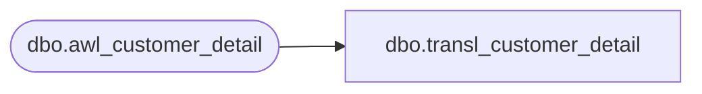

# dbo.transl_customer_detail

**Database:** auditworks  
**Server:** bedrockdb01  

## Architecture Diagram



## Table Dependencies

| Referenced Table |
|---|
| dbo.awl_customer_detail |

## View Code

```sql
CREATE VIEW dbo.transl_customer_detail AS
   SELECT store_no,
          register_no,
          entry_date_time,
          transaction_series,
          transaction_no,
          line_id,
          customer_role,
          customer_info_type,
          customer_info,
          lookup_pos_code,
          row_sequence_no,
          auto_config_verified
     FROM auditworks_work.dbo.awl_customer_detail
```

