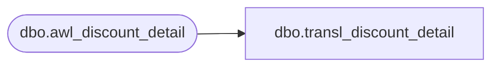

# dbo.transl_discount_detail

**Database:** auditworks  
**Server:** bedrockdb01  

## Architecture Diagram



## Table Dependencies

| Referenced Table |
|---|
| dbo.awl_discount_detail |

## View Code

```sql
CREATE VIEW dbo.transl_discount_detail AS
   SELECT store_no,
          register_no,
          entry_date_time,
          transaction_series,
          transaction_no,
          line_id,
          line_id_adj,
          pos_discount_level,
          pos_discount_type,
          pos_discount_amount,
          pos_discount_amount_adj,
          discount_amount_sign,
          discount_applied_flag,
          applied_by_line_id,
          pos_discount_serial_no,
          row_sequence_no,
          transaction_id,
          applied_flag 
     FROM auditworks_work.dbo.awl_discount_detail
```

