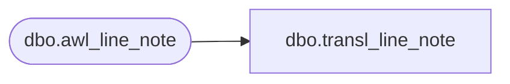

# dbo.transl_line_note

**Database:** auditworks  
**Server:** bedrockdb01  

## Architecture Diagram



## Table Dependencies

| Referenced Table |
|---|
| dbo.awl_line_note |

## View Code

```sql
CREATE VIEW dbo.transl_line_note AS
   SELECT store_no,
          register_no,
          entry_date_time,
          transaction_series,
          transaction_no,
          line_id,
          note_type,
          line_note,
          lookup_pos_code,
          pos_description,
          row_sequence_no 
     FROM auditworks_work.dbo.awl_line_note
```

