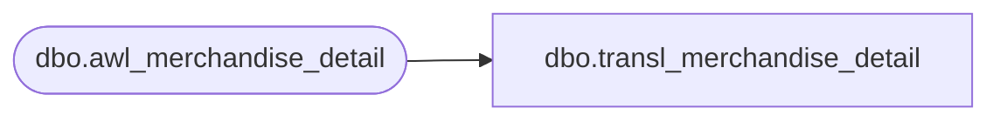

# dbo.transl_merchandise_detail

**Database:** auditworks  
**Server:** bedrockdb01  

## Architecture Diagram



## Table Dependencies

| Referenced Table |
|---|
| dbo.awl_merchandise_detail |

## View Code

```sql
CREATE VIEW dbo.transl_merchandise_detail AS
   SELECT store_no,
          register_no,
          entry_date_time,
          transaction_series,
          transaction_no,
          line_id,
          merchandise_category,
          upc_lookup_division,
          upc_no,
          units,
          units_sign,
          salesperson,
          salesperson2,
          price_override,
          pos_iplu_missing,
          pos_deptclass,
          pos_no_hit_deptclass,
          ticket_price,
          sold_at_price,
          pos_identifier,
          scanned,
          pos_identifier_type,
          row_sequence_no,
          originating_store_no,
          source_store_no,
          fulfillment_store_no,
          cost
     FROM auditworks_work.dbo.awl_merchandise_detail
```

