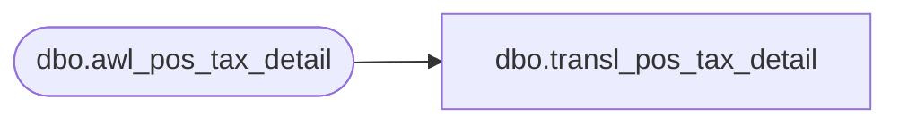

# dbo.transl_pos_tax_detail

**Database:** auditworks  
**Server:** bedrockdb01  

## Architecture Diagram



## Table Dependencies

| Referenced Table |
|---|
| dbo.awl_pos_tax_detail |

## View Code

```sql
CREATE VIEW dbo.transl_pos_tax_detail AS
   SELECT store_no,
          register_no,
          entry_date_time,
          transaction_series,
          transaction_no,
          line_id,
          tax_rate_id,
          tax_jurisdiction_id,
          tax_level,
          tax_amount_collected,
          row_sequence_no 
     FROM auditworks_work.dbo.awl_pos_tax_detail
```

