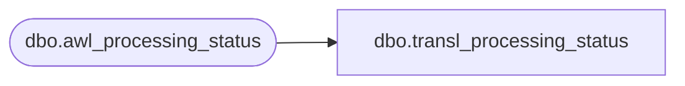

# dbo.transl_processing_status

**Database:** auditworks  
**Server:** bedrockdb01  

## Architecture Diagram



## Table Dependencies

| Referenced Table |
|---|
| dbo.awl_processing_status |

## View Code

```sql
CREATE VIEW dbo.transl_processing_status AS
   SELECT input_id,
          process_start_datetime,
          process_no,
          processing_message 
     FROM auditworks_work.dbo.awl_processing_status
```

