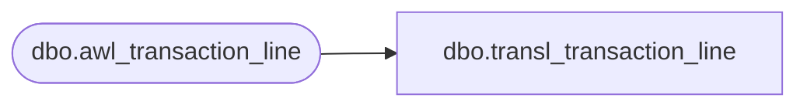

# dbo.transl_transaction_line

**Database:** auditworks  
**Server:** bedrockdb01  

## Architecture Diagram



## Table Dependencies

| Referenced Table |
|---|
| dbo.awl_transaction_line |

## View Code

```sql
CREATE VIEW dbo.transl_transaction_line AS
   SELECT store_no,
          register_no,
          entry_date_time,
          transaction_series,
          transaction_no,
          line_id,
          line_object,
          line_action,
          gross_line_amount,
          line_object_lookup_flag,
          line_amount_divider,
          unused,
          pos_discount_amount,
          gross_line_amount_sign,
          line_void_flag,
          voiding_reversal_flag,
          attachment_qty,
          line_object_adjustment,
          reference_no,
          lookup_pos_code,
          row_sequence_no,
          lookup_store,
          pos_description_token_list,
          transaction_id,
          transaction_category,
          line_object_type,
          reference_type,
          db_cr_none,
          discountable_group,
          interface_rejection_flag,
          auto_config_verified,
          discount_reversal_flag,
          encrypted_reference_no,
          unit_of_measure  
     FROM auditworks_work.dbo.awl_transaction_line
```

