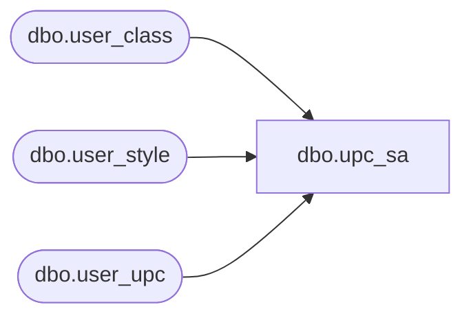

# dbo.upc_sa

**Database:** auditworks  
**Server:** bedrockdb01  

## Architecture Diagram



## Table Dependencies

| Referenced Table |
|---|
| dbo.user_class |
| dbo.user_style |
| dbo.user_upc |

## View Code

```sql
create view dbo.upc_sa  
    AS 
    SELECT u.upc_lookup_division, 
         u.upc_no, 
         u.sku_id, 
         u.style_reference_id, 
         st.style_short_description, 
         st.style_long_description, 
         st.class_code, 
         st.subclass_code, 
         c.class_description,
         class_short_description = substring(c.class_description, 1, 12), 
         c.department_code, 
         st.style_code, 
         u.color_code, 
         u.color_short_description, 
         u.prim_size_label, 
         u.sec_size_label, 
         u.tax_item_group_id,
         st.cost
    FROM auditworks.dbo.user_upc u,
    auditworks.dbo.user_style st,
    auditworks.dbo.user_class c
    WHERE u.style_reference_id = st.style_reference_id 
      AND u.upc_lookup_division = st.upc_lookup_division
      AND st.class_code = c.class_code 
      AND st.upc_lookup_division = c.upc_lookup_division
```

