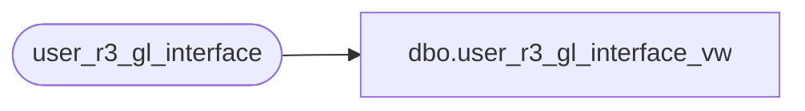

# dbo.user_r3_gl_interface_vw

**Database:** auditworks  
**Server:** bedrockdb01  

## Architecture Diagram



## Table Dependencies

| Referenced Table |
|---|
| user_r3_gl_interface |

## View Code

```sql
create view user_r3_gl_interface_vw
AS
SELECT
run_group,seq_number,company,old_company,old_acct_no,source_code,calendar_date,refer,description,
currency,units_amt,trans_amt,base_amt,baserate,system,program_code,autorev,posting_date,activity,
acct_catg,doc_nbr,to_base_amt,effect_date,jnl_book_nbr,mx1,mx2,mx3,jbk_seq_nbr,neg_adjst,segment_block,
report_amt_1,report_rate_1,report_nd_1,report_amt_2,report_rate_2,report_nd_2
FROM user_r3_gl_interface
GROUP BY run_group,seq_number,company,old_company,old_acct_no,source_code,calendar_date,refer,description,
currency,units_amt,trans_amt,base_amt,baserate,system,program_code,autorev,posting_date,activity,
acct_catg,doc_nbr,to_base_amt,effect_date,jnl_book_nbr,mx1,mx2,mx3,jbk_seq_nbr,neg_adjst,segment_block,
report_amt_1,report_rate_1,report_nd_1,report_amt_2,report_rate_2,report_nd_2
```

