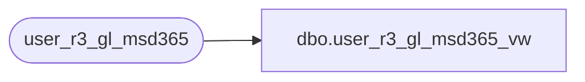

# dbo.user_r3_gl_msd365_vw

**Database:** auditworks  
**Server:** bedrockdb01  

## Architecture Diagram



## Table Dependencies

| Referenced Table |
|---|
| user_r3_gl_msd365 |

## View Code

```sql
CREATE view [dbo].[user_r3_gl_msd365_vw]
AS
SELECT 	gl_company,
	store_no,
	calendar_date,
	JOURNALBATCHNUMBER,
	GLCOMPNY,
	LINENUMBER,
	ACCOUNTDISPLAYVALUE,
	ACCOUNTTYPE,
	DFLTDIMENSIONDISPVALUE,
	BANKTRANSTYPE,
	PAYMENTREFERENCE,
	CREDITAMOUNT,
	CURRENCY,
	DEBITAMOUNT,
	DESCRIPTION,
	JOURNALNAME,
	TEXT,
	TRANSDATE,
	VOUCHER
FROM user_r3_gl_msd365
GROUP BY 	gl_company,
	LINENUMBER,
	store_no,
	calendar_date,
	JOURNALBATCHNUMBER,
	GLCOMPNY,
	ACCOUNTDISPLAYVALUE,
	ACCOUNTTYPE,
	DFLTDIMENSIONDISPVALUE,
	BANKTRANSTYPE,
	PAYMENTREFERENCE,	
	CREDITAMOUNT,
	CURRENCY,
	DEBITAMOUNT,
	DESCRIPTION,
	JOURNALNAME,
	TEXT,
	TRANSDATE,
	VOUCHER
```

