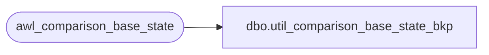

# dbo.util_comparison_base_state_bkp

**Database:** auditworks  
**Server:** bedrockdb01  

## Architecture Diagram



## Table Dependencies

| Referenced Table |
|---|
| awl_comparison_base_state |

## View Code

```sql
create view dbo.util_comparison_base_state_bkp  as
select *
from auditworks_work..awl_comparison_base_state
```

