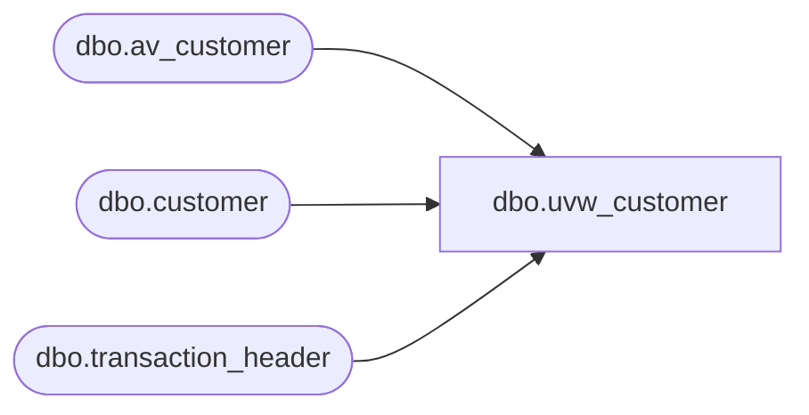

# dbo.uvw_customer

**Database:** auditworks  
**Server:** bedrockdb01  

## Architecture Diagram



## Table Dependencies

| Referenced Table |
|---|
| dbo.av_customer |
| dbo.customer |
| dbo.transaction_header |

## View Code

```sql
-- Blocked out duplicates G. Murrish 12/31/2013
CREATE VIEW [dbo].[uvw_customer]
AS
SELECT
	[transaction_id]
	--      ,[from_line_id]
	,
	[customer_role],
	title AS [Title],
	[first_name],
	[last_name],
	[address_1],
	[address_2],
	city AS [City],
	county AS [County],
	state AS [State],
	country AS [Country],
	[post_code],
	[telephone_no1],
	[telephone_no2],
	[customer_no],
	[more_info_flag],
	[pos_tax_jurisdiction_code],
	fax AS [Fax],
	[email_address]
FROM
	[auditworks].[dbo].[customer] WITH (NOLOCK)
UNION
SELECT
	[av_transaction_id] AS transaction_id
	--      ,[from_line_id]
	,
	av.[customer_role],
	av.title AS [Title],
	av.[first_name],
	av.[last_name],
	av.[address_1],
	av.[address_2],
	av.city AS [City],
	av.county AS [County],
	av.state AS [State],
	av.country AS [Country],
	av.[post_code],
	av.[telephone_no1],
	av.[telephone_no2],
	av.[customer_no],
	av.[more_info_flag],
	av.[pos_tax_jurisdiction_code],
	av.fax AS [Fax],
	av.[email_address]
FROM
	[auditworks].[dbo].[av_customer] av WITH (NOLOCK)
	LEFT JOIN auditworks.dbo.transaction_header th WITH (NOLOCK)
		ON av.av_transaction_id = th.transaction_id
WHERE
	th.transaction_id IS NULL
```

