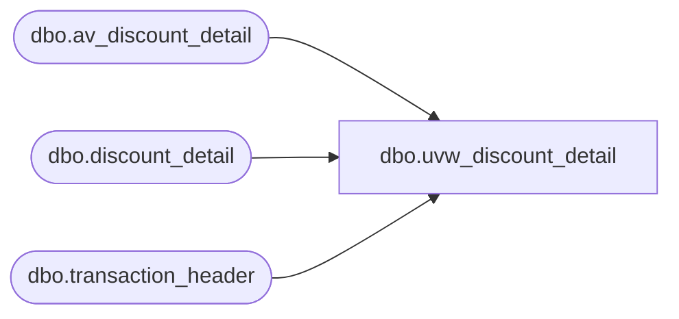

# dbo.uvw_discount_detail

**Database:** auditworks  
**Server:** bedrockdb01  

## Architecture Diagram



## Table Dependencies

| Referenced Table |
|---|
| dbo.av_discount_detail |
| dbo.discount_detail |
| dbo.transaction_header |

## View Code

```sql
-- Blocked out duplicates G. Murrish 12/31/2013
CREATE VIEW [dbo].[uvw_discount_detail]
AS
SELECT
	[transaction_id],
	[line_id],
	[applied_by_line_id],
	[pos_discount_level],
	[pos_discount_type],
	[pos_discount_amount],
	[applied_flag],
	[pos_discount_serial_no]
FROM
	[auditworks].[dbo].discount_detail WITH (NOLOCK)
UNION
SELECT
	[av_transaction_id] AS transaction_id,
	av.[line_id],
	av.[applied_by_line_id],
	av.[pos_discount_level],
	av.[pos_discount_type],
	av.[pos_discount_amount],
	av.[applied_flag],
	av.[pos_discount_serial_no]
FROM
	[auditworks].[dbo].av_discount_detail av WITH (NOLOCK)
	LEFT JOIN auditworks.dbo.transaction_header th WITH (NOLOCK)
		ON av.av_transaction_id = th.transaction_id
WHERE
	th.transaction_id IS NULL
```

