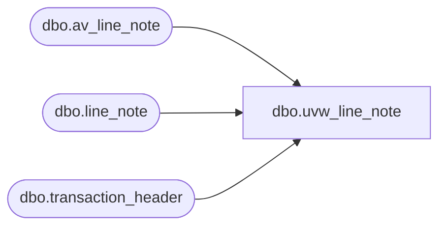

# dbo.uvw_line_note

**Database:** auditworks  
**Server:** bedrockdb01  

## Architecture Diagram



## Table Dependencies

| Referenced Table |
|---|
| dbo.av_line_note |
| dbo.line_note |
| dbo.transaction_header |

## View Code

```sql
-- Blocked duplicates from Archive G. Murrish 12/31/2013
CREATE VIEW [dbo].[uvw_line_note]
AS
SELECT
	[transaction_id],
	line_id,
	note_type,
	[line_note]
FROM
	[auditworks].[dbo].[line_note] WITH (NOLOCK)
UNION
SELECT
	[av_transaction_id] AS transaction_id,
	av.line_id,
	av.note_type,
	av.[line_note]
FROM
	[auditworks].[dbo].[av_line_note] av WITH (NOLOCK)
	LEFT JOIN auditworks.dbo.transaction_header th WITH (NOLOCK)
		ON av.av_transaction_id = th.transaction_id
WHERE
	th.transaction_id IS NULL
```

