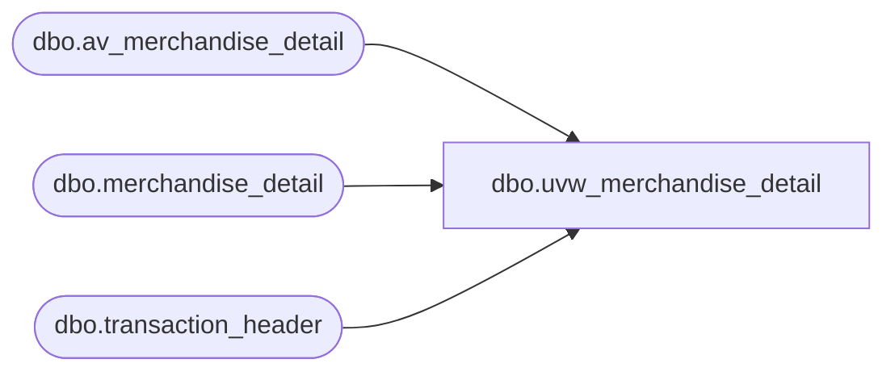

# dbo.uvw_merchandise_detail

**Database:** auditworks  
**Server:** bedrockdb01  

## Architecture Diagram



## Table Dependencies

| Referenced Table |
|---|
| dbo.av_merchandise_detail |
| dbo.merchandise_detail |
| dbo.transaction_header |

## View Code

```sql
-- Blocked duplicates from Archive G. Murrish 12/31/2013
CREATE VIEW [dbo].[uvw_merchandise_detail]
AS
SELECT
	[transaction_id],
	[line_id],
	[merchandise_category],
	[upc_lookup_division],
	[upc_no],
	[units],
	[salesperson],
	[salesperson2],
	[sku_id],
	[style_reference_id],
	[class_code],
	[subclass_code],
	[price_override],
	[pos_iplu_missing],
	[upc_on_file_flag],
	[salesperson_on_file_flag],
	[salesperson2_on_file_flag],
	[pos_deptclass],
	[ticket_price],
	[sold_at_price],
	[scanned],
	[pos_identifier],
	[pos_identifier_type],
	[plu_price],
	[originating_store_no],
	[source_store_no],
	[fulfillment_store_no]
FROM
	[auditworks].[dbo].[merchandise_detail] WITH (NOLOCK)
UNION
SELECT
	[av_transaction_id] AS transaction_id,
	av.[line_id],
	av.[merchandise_category],
	av.[upc_lookup_division],
	av.[upc_no],
	av.[units],
	av.[salesperson],
	av.[salesperson2],
	av.[sku_id],
	av.[style_reference_id],
	av.[class_code],
	av.[subclass_code],
	av.[price_override],
	av.[pos_iplu_missing],
	av.[upc_on_file_flag],
	0 AS [salesperson_on_file_flag],
	0 AS [salesperson2_on_file_flag],
	av.[pos_deptclass],
	av.[ticket_price],
	av.[sold_at_price],
	av.[scanned],
	av.[pos_identifier],
	av.[pos_identifier_type],
	av.[plu_price],
	av.[originating_store_no],
	av.[source_store_no],
	av.[fulfillment_store_no]
FROM
	[auditworks].[dbo].[av_merchandise_detail] av WITH (NOLOCK)
	LEFT JOIN auditworks.dbo.transaction_header th WITH (NOLOCK)
		ON av.av_transaction_id = th.transaction_id
```

