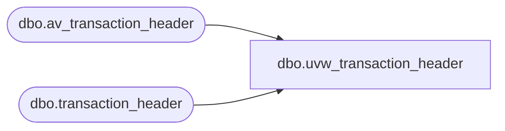

# dbo.uvw_transaction_header

**Database:** auditworks  
**Server:** bedrockdb01  

## Architecture Diagram



## Table Dependencies

| Referenced Table |
|---|
| dbo.av_transaction_header |
| dbo.transaction_header |

## View Code

```sql
-- Blocked out duplicates G. Murrish 12/31/2013

CREATE VIEW [dbo].[uvw_transaction_header]
AS
SELECT
	[transaction_id],
	[store_no],
	[register_no],
	[transaction_date],
	[date_reject_id],
	[transaction_series],
	[transaction_no],
	[entry_date_time],
	[cashier_no],
	[transaction_category],
	[tender_total],
	[transaction_void_flag],
	[customer_info_exists],
	[exception_flag],
	[sa_rejection_flag],
	[if_rejection_flag],
	[deposit_declaration_flag],
	[closeout_flag],
	[media_count_flag],
	[customer_modified_flag],
	[tax_override_flag],
	[pos_tax_jurisdiction],
	[edit_progress_flag],
	[edit_timestamp],
	[employee_no],
	[transaction_remark],
	[copy_transaction_id],
	[last_modified_date_time],
	[in_use_timestamp],
	[till_no]
FROM
	[auditworks].[dbo].[transaction_header] WITH (NOLOCK)
UNION
SELECT
	[av_transaction_id] AS transaction_id,
	av.[store_no],
	av.[register_no],
	av.[transaction_date],
	av.[date_reject_id],
	av.[transaction_series],
	av.[transaction_no],
	av.[entry_date_time],
	av.[cashier_no],
	av.[transaction_category],
	av.[tender_total],
	av.[transaction_void_flag],
	av.[customer_info_exists],
	av.[exception_flag],
	av.[sa_rejection_flag],
	av.[if_rejection_flag],
	av.[deposit_declaration_flag],
	av.[closeout_flag],
	av.[media_count_flag],
	av.[customer_modified_flag],
	av.[tax_override_flag],
	av.[pos_tax_jurisdiction],
	av.[edit_progress_flag],
	av.[edit_timestamp],
	av.[employee_no],
	av.[transaction_remark],
	av.[copy_transaction_id],
	av.[last_modified_date_time],
	av.[in_use_timestamp],
	av.[till_no]
FROM
	[auditworks].[dbo].[av_transaction_header] av WITH (NOLOCK)
	LEFT JOIN auditworks.dbo.transaction_header th WITH (NOLOCK)
		ON th.transaction_id = av.av_transaction_id
WHERE
	th.transaction_id IS NULL
```

