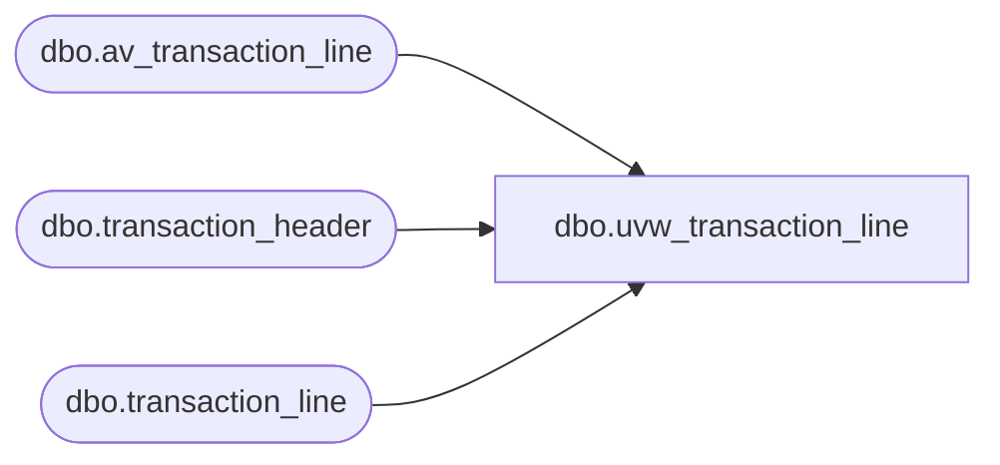

# dbo.uvw_transaction_line

**Database:** auditworks  
**Server:** bedrockdb01  

## Architecture Diagram



## Table Dependencies

| Referenced Table |
|---|
| dbo.av_transaction_line |
| dbo.transaction_header |
| dbo.transaction_line |

## View Code

```sql
-- Blocked duplicates from Archive.
CREATE VIEW [dbo].[uvw_transaction_line]
AS
SELECT
	[transaction_id],
	[line_id],
	[line_sequence],
	[line_object_type],
	[line_object],
	[line_action],
	[gross_line_amount],
	[pos_discount_amount],
	[db_cr_none],
	[attachment_qty],
	[exception_flag],
	[interface_rejection_flag],
	[line_void_flag],
	[voiding_reversal_flag],
	[edit_timestamp],
	[reference_type],
	[reference_no]
FROM
	[auditworks].[dbo].[transaction_line] WITH (NOLOCK)
UNION
SELECT
	[av_transaction_id] AS transaction_id,
	av.[line_id],
	av.[line_sequence],
	av.[line_object_type],
	av.[line_object],
	av.[line_action],
	av.[gross_line_amount],
	av.[pos_discount_amount],
	av.[db_cr_none],
	av.[attachment_qty],
	av.[exception_flag],
	av.[interface_rejection_flag],
	av.[line_void_flag],
	av.[voiding_reversal_flag],
	av.[edit_timestamp],
	av.[reference_type],
	av.[reference_no]
FROM
	[auditworks].[dbo].[av_transaction_line] av WITH (NOLOCK)
	LEFT JOIN auditworks.dbo.transaction_header th WITH (NOLOCK)
		ON av.av_transaction_id = th.transaction_id
WHERE
	th.transaction_id IS NULL
```

