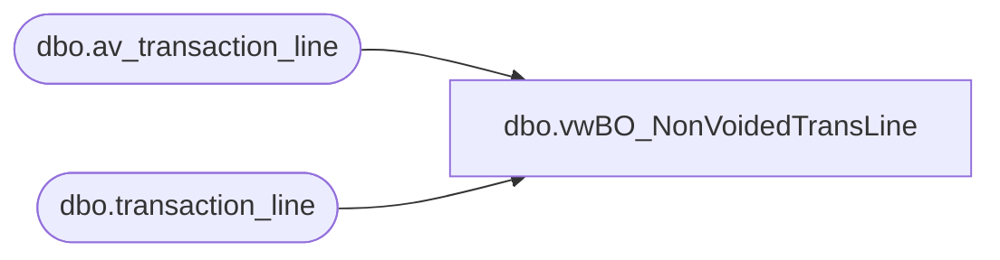

# dbo.vwBO_NonVoidedTransLine

**Database:** auditworks  
**Server:** bedrockdb01  

## Architecture Diagram



## Table Dependencies

| Referenced Table |
|---|
| dbo.av_transaction_line |
| dbo.transaction_line |

## View Code

```sql
CREATE VIEW dbo.vwBO_NonVoidedTransLine
AS
SELECT 
[transaction_id], [line_id] ,[line_sequence], [line_object_type] ,[line_object] 
,[line_action],[gross_line_amount], [pos_discount_amount], [exception_flag]
,[line_void_flag], [voiding_reversal_flag],[reference_type],[reference_no] 
 --,[db_cr_none] ,[attachment_qty], [interface_rejection_flag],[line_modified_flag], [edit_timestamp],  [discountable_group], [invalid_reference_no]
FROM [auditworks].[dbo].[transaction_line]
WHERE line_void_flag <> 1
UNION
SELECT 
[av_transaction_id], [line_id] ,[line_sequence], [line_object_type] ,[line_object] 
,[line_action],[gross_line_amount], [pos_discount_amount], [exception_flag]
,[line_void_flag], [voiding_reversal_flag],[reference_type],[reference_no] 
--,[db_cr_none], [attachment_qty], [interface_rejection_flag],[edit_timestamp]
FROM [auditworks].[dbo].[av_transaction_line]
WHERE line_void_flag <> 1
```

