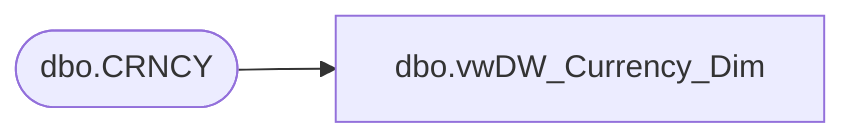

# dbo.vwDW_Currency_Dim

**Database:** auditworks  
**Server:** bedrockdb01  

## Architecture Diagram



## Table Dependencies

| Referenced Table |
|---|
| dbo.CRNCY |

## View Code

```sql
CREATE VIEW [dbo].[vwDW_Currency_Dim]
AS

SELECT cast([CRNCY_CODE] as char(3)) as currency_code
      ,cast(substring([CRNCY_DESC], 1, 50) as varchar(50)) as currency_desc
  FROM [auditworks].[dbo].[CRNCY] with (nolock)
```

