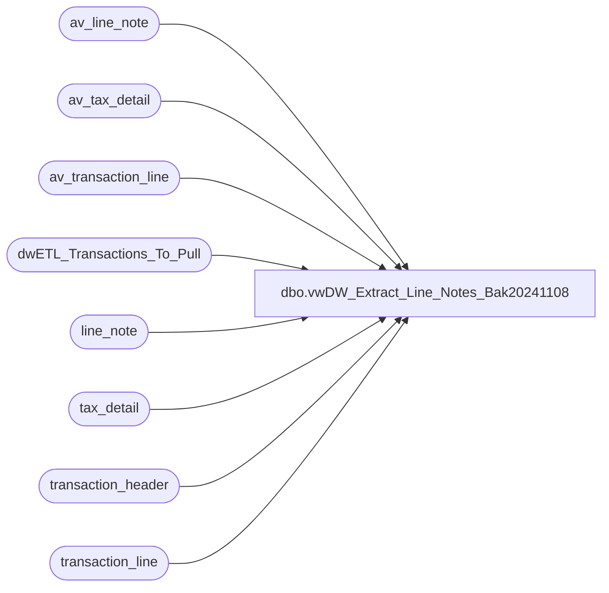

# dbo.vwDW_Extract_Line_Notes_Bak20241108

**Database:** auditworks  
**Server:** bedrockdb01  

## Architecture Diagram



## Table Dependencies

| Referenced Table |
|---|
| av_line_note |
| av_tax_detail |
| av_transaction_line |
| dwETL_Transactions_To_Pull |
| line_note |
| tax_detail |
| transaction_header |
| transaction_line |

## View Code

```sql
-- =====================================================================================================
-- Name: vwDW_Extract_Line_Notes
--
-- Description:	Extract Line Notes from Audit works based upon the
--			transaction numbers loaded into 
--
--
-- Dependencies: None
--
-- Revision History
--		Name:			Date:			Comments:
--		Gary Murrish	4/20/2013		Created
--		Gary Murrish	12/31/2013		Blocked duplicates from Archive
--		Dan Tweedie		07/28/2016		Cast line_note as nvarchar to aid in handling Chinese characters in SSIS load
--		Dan Tweedie		2023-08-08		Derived new line_note by removing 'PRM', 'DM', 'CPN' which are from Jump Mind and not in our coupon dim
--		Tim Callahan	2023-10-05		Added CTE\UNION to Get UK VAT Tax Data from Tax Detail Tables
--										This is due to instances where VAT Tax Line notes did not come through via a non Aptos sales interface
--		Tim Callahan	2024-02-02		Added CTE\Logic to Override VAT Tax for Donation Item Line Objects to be 0.00
-- =====================================================================================================
CREATE VIEW [dbo].[vwDW_Extract_Line_Notes_Bak20241108]
AS

--with
--Prep as
--	(
--		SELECT
--			trig.transaction_id,
--			ln.line_id,
--			ln.note_type,
--			cast(ln.line_note as nvarchar) as line_note
--		FROM
--			dwETL_Transactions_To_Pull trig WITH (NOLOCK)
--			INNER JOIN line_note ln WITH (NOLOCK)
--				ON trig.transaction_id = ln.transaction_id
--		UNION ALL
--		SELECT
--			trig.transaction_id,
--			ln.line_id,
--			ln.note_type,
--			cast(ln.line_note as nvarchar) as line_note
--		FROM
--			dwETL_Transactions_To_Pull trig WITH (NOLOCK)
--			INNER JOIN av_line_note ln WITH (NOLOCK)
--				ON trig.transaction_id = ln.av_transaction_id
--			LEFT JOIN transaction_header th WITH (NOLOCK)
--				ON trig.transaction_id = th.transaction_id
--			WHERE th.transaction_id IS null
--	)
-- Replaced Above on 10/5/2023

with 
Prep as

(


		SELECT
			trig.transaction_id,
			ln.line_id,
			ln.note_type,
			cast(ln.line_note as nvarchar) as line_note
		FROM dwETL_Transactions_To_Pull trig WITH (NOLOCK)	
				INNER JOIN line_note ln WITH (NOLOCK) ON trig.transaction_id = ln.transaction_id
		where ln.note_type <> 35 -- 35 = VAT Note Type 
			UNION ALL
			-- Union in VAT Line Notes 
		SELECT
			trig.transaction_id,
			ln.line_id,
			ln.note_type,
			cast (cast(ln.line_note as numeric (35,6)) as nvarchar) as line_note
		FROM dwETL_Transactions_To_Pull trig WITH (NOLOCK)
			INNER JOIN line_note ln WITH (NOLOCK)ON trig.transaction_id = ln.transaction_id
		where ln.note_type = 35 -- 35 = VAT Note Type 
		
			-- Union In Archive TAbles 
			union all 
			
		SELECT
			trig.transaction_id,
			ln.line_id,
			ln.note_type,
			cast(ln.line_note as nvarchar) as line_note 					
		FROM dwETL_Transactions_To_Pull trig WITH (NOLOCK)
			INNER JOIN av_line_note ln WITH (NOLOCK) ON trig.transaction_id = ln.av_transaction_id
			LEFT JOIN transaction_header th WITH (NOLOCK) ON trig.transaction_id = th.transaction_id
		WHERE th.transaction_id IS null		
			and ln.note_type <> 35-- 35 = VAT Note Type 

			union all 
			-- Union in Archive VAT Line Notes 
		SELECT
			trig.transaction_id,
			ln.line_id,
			ln.note_type,
			cast (cast(ln.line_note as numeric (35,6)) as nvarchar) as line_note
		FROM dwETL_Transactions_To_Pull trig WITH (NOLOCK)
			INNER JOIN av_line_note ln WITH (NOLOCK) ON trig.transaction_id = ln.av_transaction_id
			LEFT JOIN transaction_header th WITH (NOLOCK) ON trig.transaction_id = th.transaction_id
		WHERE th.transaction_id IS null		
			and ln.note_type = 35 -- 35 = VAT Note Type 

) 


-- Added on 10/5/2023
,VatFromTaxDetail  as
(

	select 
	td.transaction_id, 
	td.line_id, 
	cast (35 as int) as note_type, 
	cast (cast (sum (td.tax_amount_expected) as nvarchar)as numeric (35,6)) as line_note
	from tax_detail td (nolock) 
	join dwETL_Transactions_To_Pull trig (NOLOCK) on trig.transaction_id=td.transaction_id
	where 1=1
	and td.tax_jurisdiction in ('GBP') -- Ireland (EIRE) include? They dont have JM pos yet so fix should be in before then 
	and td.applied_by_line_id is null  -- A None full value is Indicative of Discount Tax Detail - These do not appear to be in the Aptos POS line notes 
	--and td.transaction_id in ('481464873')  -- Testing Only
	group by 
	td.transaction_id, 
	td.line_id
		union
	select 
	td.av_transaction_id as transaction_id , 
	td.line_id, 
	cast (35 as int) as note_type, 
	cast (cast (sum (td.tax_amount_expected) as nvarchar)as numeric (35,6)) as line_note
	from av_tax_detail td (nolock) 
	join dwETL_Transactions_To_Pull trig (nolock) on trig.transaction_id=td.av_transaction_id
	left join transaction_header th (nolock) on trig.transaction_id = th.transaction_id
	where 1=1
	and th.transaction_id is null 
	and td.tax_jurisdiction in ('GBP') -- Ireland (EIRE) include? They dont have JM pos yet so fix should be in before then 
	and td.applied_by_line_id is null  -- A None full value is Indicative of Discount Tax Detail - These do not appear to be in the Aptos POS line notes 
	--and td.av_transaction_id in ('481464873') -- Testing Only
	group by 
	td.av_transaction_id,
	td.line_id

), 


Summary1 as
(

select
	transaction_id,
	line_id,
	note_type,
	cast(replace(replace(replace(line_note, 'PRM',''), 'DM',''), 'CPN','') as nvarchar) as line_note
from Prep
where line_note<>' '
	union 
select 
	transaction_id, 
	line_id, 
	note_type, 
	cast (line_note as nvarchar) as line_note
from VatFromTaxDetail v

), 

DonationOverride as 
(

-- Identify Lines that are Donation Line Objects and have tax against them 
-- These should not have VAT tax against them 
select 
trig.transaction_id, 
tl.line_id
FROM dwETL_Transactions_To_Pull trig (nolock) 
join transaction_line tl (nolock) on tl.transaction_id = trig.transaction_id
join tax_detail td (nolock) on td.transaction_id = tl.transaction_id 
				and tl.line_id = td.line_id
where 1=1
and tl.line_object in ('101','292') -- Donation Line Objects 
and td.tax_amount <> 0.00 -- Performance Purposes 
group by
trig.transaction_id, 
td.line_id, 
tl.line_id
	union 
select 
trig.transaction_id, 
tl.line_id
FROM dwETL_Transactions_To_Pull trig (nolock) 
join av_transaction_line tl (nolock) on tl.av_transaction_id = trig.transaction_id
join av_tax_detail td (nolock) on td.av_transaction_id = tl.av_transaction_id 
				and tl.line_id = td.line_id
left join transaction_header th (nolock) on trig.transaction_id = th.transaction_id
where 1=1
and th.transaction_id is null  -- Transaction Is Not In current Period 
and tl.line_object in ('101','292') -- Donation Line Objects 
and td.tax_amount <> 0.00 -- Performance Purposes 
group by
trig.transaction_id, 
td.line_id, 
tl.line_id


), 

Summary2 as (

select
transaction_id, 
line_id, 
note_type, 
max (line_note) as line_note -- With the alternate VAT source it seems like some rounding is in play with non aptos sales interface feed, so I will except the higher value
from Summary1 s
group by
transaction_id, 
line_id, 
note_type
) 

select 
s.transaction_id, 
s.line_id, 
s.note_type, 
case when do.transaction_id is not null and s.note_type = '35'
	then '0.000000'
	else s.line_note end as line_note 
from Summary2 s
left join DonationOverride do on do.transaction_id = s.transaction_id
					and do.line_id = s.line_id
					and s.note_type = '35'
where 1=1
```

