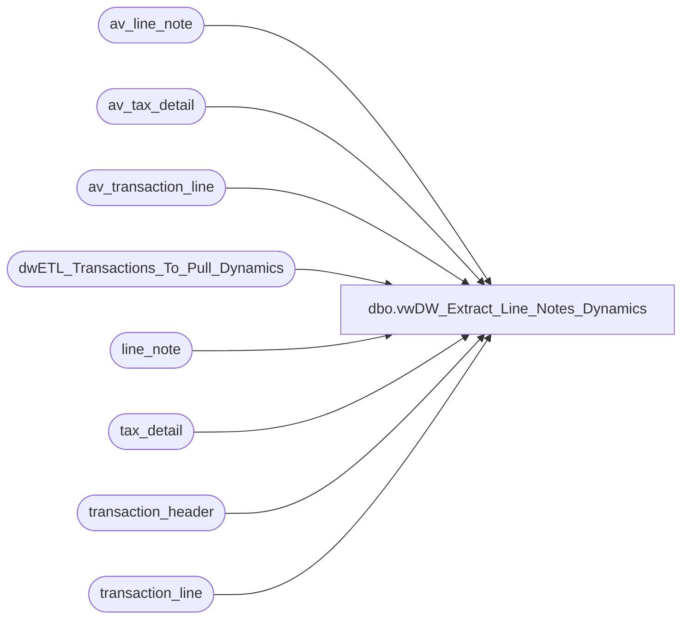

# dbo.vwDW_Extract_Line_Notes_Dynamics

**Database:** auditworks  
**Server:** bedrockdb01  

## Architecture Diagram



## Table Dependencies

| Referenced Table |
|---|
| av_line_note |
| av_tax_detail |
| av_transaction_line |
| dwETL_Transactions_To_Pull_Dynamics |
| line_note |
| tax_detail |
| transaction_header |
| transaction_line |

## View Code

```sql
---- =====================================================================================================
---- Name: vwDW_Extract_Line_Notes
----
---- Description:	Extract Line Notes from Audit works based upon the
----			transaction numbers loaded into 
----
----
---- Dependencies: None
----
---- Revision History
----		Name:			Date:			Comments:
----		Gary Murrish	4/20/2013		Created
----		Gary Murrish	12/31/2013		Blocked duplicates from Archive
----		Dan Tweedie		07/28/2016		Cast line_note as nvarchar to aid in handling Chinese characters in SSIS load
----		Dan Tweedie		2023-08-08		Derived new line_note by removing 'PRM', 'DM', 'CPN' which are from Jump Mind and not in our coupon dim
----		Tim Callahan	2023-10-05		Added CTE\UNION to Get UK VAT Tax Data from Tax Detail Tables
----										This is due to instances where VAT Tax Line notes did not come through via a non Aptos sales interface
----		Tim Callahan	2024-02-02		Added CTE\Logic to Override VAT Tax for Donation Item Line Objects to be 0.00
---- =====================================================================================================
CREATE VIEW [dbo].[vwDW_Extract_Line_Notes_Dynamics]
AS

--with 
--Prep as
--	(
--		SELECT
--			trig.transaction_id,
--			ln.line_id,
--			ln.note_type,
--			cast(ln.line_note as nvarchar) as line_note
--		FROM
--			dwETL_Transactions_To_Pull_Dynamics trig WITH (NOLOCK)
--			INNER JOIN line_note ln WITH (NOLOCK)
--				ON trig.transaction_id = ln.transaction_id
--		UNION ALL
--		SELECT
--			trig.transaction_id,
--			ln.line_id,
--			ln.note_type,
--			cast(ln.line_note as nvarchar) as line_note 
					
--		FROM
--			dwETL_Transactions_To_Pull_Dynamics trig WITH (NOLOCK)
--			INNER JOIN av_line_note ln WITH (NOLOCK)
--				ON trig.transaction_id = ln.av_transaction_id
--			LEFT JOIN transaction_header th WITH (NOLOCK)
--				ON trig.transaction_id = th.transaction_id
--			WHERE th.transaction_id IS null		
--	)

-- Replaced Above on 10/5/2023
with 
Prep as

(


		SELECT
			trig.transaction_id,
			ln.line_id,
			ln.note_type,
			cast(ln.line_note as nvarchar) as line_note
		FROM dwETL_Transactions_To_Pull_Dynamics trig WITH (NOLOCK)	
				INNER JOIN line_note ln WITH (NOLOCK) ON trig.transaction_id = ln.transaction_id
		where ln.note_type <> 35 -- 35 = VAT Note Type 
			UNION ALL
			-- Union in VAT Line Notes 
		SELECT
			trig.transaction_id,
			ln.line_id,
			ln.note_type,
			cast (cast(ln.line_note as numeric (35,6)) as nvarchar) as line_note
		FROM dwETL_Transactions_To_Pull_Dynamics trig WITH (NOLOCK)
			INNER JOIN line_note ln WITH (NOLOCK)ON trig.transaction_id = ln.transaction_id
		where ln.note_type = 35 -- 35 = VAT Note Type 
		
			-- Union In Archive TAbles 
			union all 
			
		SELECT
			trig.transaction_id,
			ln.line_id,
			ln.note_type,
			cast(ln.line_note as nvarchar) as line_note 					
		FROM dwETL_Transactions_To_Pull_Dynamics trig WITH (NOLOCK)
			INNER JOIN av_line_note ln WITH (NOLOCK) ON trig.transaction_id = ln.av_transaction_id
			LEFT JOIN transaction_header th WITH (NOLOCK) ON trig.transaction_id = th.transaction_id
		WHERE th.transaction_id IS null		
			and ln.note_type <> 35-- 35 = VAT Note Type 

			union all 
			-- Union in Archive VAT Line Notes 
		SELECT
			trig.transaction_id,
			ln.line_id,
			ln.note_type,
			cast (cast(ln.line_note as numeric (35,6)) as nvarchar) as line_note
		FROM dwETL_Transactions_To_Pull_Dynamics trig WITH (NOLOCK)
			INNER JOIN av_line_note ln WITH (NOLOCK) ON trig.transaction_id = ln.av_transaction_id
			LEFT JOIN transaction_header th WITH (NOLOCK) ON trig.transaction_id = th.transaction_id
		WHERE th.transaction_id IS null		
			and ln.note_type = 35 -- 35 = VAT Note Type 
			-- Condition Below Added on Nov 8 2024
			-- Deck had issues with bundle skus, we need to ignore the VAT Line Notes and Only Capture VAT from Tax Detail 
			and ln.av_transaction_id not in ('496066271','496072299','496077338','496075208','496067481','496077324','496067419','496070573','496067473','496075168','496067435','496070587','496075209','496066274','496067482','496079615','496066275','496082053','496066649','496067427','496066630','496075176','496067223','496067137','496067204','496072292','496097876','496075178','496066631','496067436','496075206','496070572','496079618','496082055','496099465','496101490','496101461','496118766','496099118','496098477','496105372','496108134','496108104','496110624','496110627','496108107','496105388','496099091','496136021','496099457','496136019','496099131','496105392','496098476','496099986','496099117','496098503','496136033','496110625','496099988','496105375','496099466','496100016','496098504','496103329','496103341','496099109','496103332','496101475','496108120','496136044','496136027','496101488','496099461','496100017','496110640','496099996','496121380','496101463','496099449','496110642','496190186','496138929','496138931','496160652','496157038','496137907','496160651','496137895','496137909','496144675','496136841','496138930','496137920','496147839','496147842','496147855','496160649','496137913','496151816','496160646','496137923','496138928','496137912','496138924','496136828','496141886','496190184','496147854','496147843','496157063','496157047','496157045','496141898','496151818','496160653','496147857','496141867','496151794','496141942','496151817','496190179','496144683','496137905','496137904','496192446','496192427','496192422','496191716','496230313','496230329','496195217','496193227','496230331','496190621','496193195','496193222','496202450','496192414','496195216','496199168','496193217','496195232','496204579','496197309','496190600','496193228','496199169','496230327','496204599','496191687','496193183','496192401','496195233','496199189','496230306','496193200','496230312','496230339','496209308','496192424','496230352','496193226','496193208','496190602','496202460','496237336','496241144','496237333','496235785','496231795','496232745','496232739','496232732','496239433','496257966','496232763','496235776','496232731','496232729','496232322','496232285','496232752','496241134','496237408','496232740','496239452','496241139','496230987','496231666','496231652','496231812','496232762','496232751','496231670','496241145','496239426','496244637','496239462','496230990','496235800','496232308','496234001','496257994','496239441','496237321','496232753','496235787','496231682','496234003','496237343','496239419','496241136','496231791','496239428','496231789','496231653','496258012','496231679','496258011','496239445','496241146','496235789','496239423','496232749','496231811','496241147','496233991','496239448','496233989','496233975','496258008','496232277','496234007','496232728','496239447','496231790','496237317','496233998','496239438','496260650','496259190','496258599','496259195','496258572','496260637','496264901','496259188','496259185','496261823','496261853','496259704','496261882','496258567','496283815','496259206','496259192','496259186','496261880','496266592','496269677','496258553','496283817','496259679','496258571','496258592','496261824','496269678','496259703','496259197','496260647','496260596','496259698','496259700','496258596','496266602','496259673','496258573','496259194','496258574','496258551','496269682','496259696','496283836','496259723','496259213','496260656','496258576','496264894','496283818','496268091','496260588','496260652','496260666','496310930','496287223','496287201','496290657','496290655','496287232','496287224','496289309','496287222','496289305','496285377','496287196','496295814','496289330','496290639','496292422','496289334','496289321','496290656','496285863','496290625','496290635','496295815','496290671','496289320','496290648','496289327','496287216','496287199','496289317','496285864','496294212','496292463','496290636','496294207','496292462','496287217','496289328','496294209','496289374','496284940','496285865','496287287','496287211','496284927','496285478','496310903','496284267','496294206','496289319','496290627','496294215','496290649','496292433','496292420','496289311','496287233','496285880','496284243','496292438','496337604','496313570','496322364','496310939','496313542','496316946','496337608','496315277','496320376','496316915','496318924','496313646','496316916','496313402','496320375','496313422','496310940','496316950','496313627','496313539','496313519','496313425','496310974','496316902','496310985','496316969','496316961','496313427','496313492','496313431','496313532','496337589','496313576','496313447','496337605','496324191','496320367','496313388','496313649','496313650','496313386','496313490','496313551','496315281','496318916','496313448','496313636','496313457','496337618','496310989','496337617','496316891','496322362','496313592','496337592','496316890','496313478','496313633','496313482','496313401','496313538','496313408','496313635','496318905','496315266','496313545','496313547','496322368','496337645','496316887','496313544','496313620','496322369','496313380','496337619','496313423','496313462','496313611','496320363','496315283','496337622','496337635','496313384','496313535','496322367','496313562','496313561','496322370','496310934','496313446','496310968','496313382','496313452','496313632','496313639','496313560','496316914','496313454','496313534','496316949','496318989','496344659','496339232','496346765','496375045','496339214','496344658','496351445','496346714','496342545','496340685','496351455','496375049','496354447','496340781','496340737','496342530','496339785','496342525','496351453','496342524','496338338','496349503','496339787','496339233','496374991','496339226','496339230','496346762','496339209','496375014','496349496','496339879','496349499','496349492','496349490','496339210','496338312','496339237','496338305','496344671','496339881','496342589','496339231','496344664','496344739','496339887','496344665','496339882','496349497','496349518','496351454','496344653','496354437','496346758','496340780','496338325','496339811','496339788','496346783','496346788','496351526','496344680','496351450','496342602','496342542','496339240','496339792','496346706','496346703','496339212','496344661','496339807','496349489','496340680','496354474','496338302','496340682','496339836','496338303','496349504','496338320','496351524','496339791','496349491','496344656','496349524','496339241','496342511','496375048','496346790','496351451','496340707','496346759','496344733','496339801','496339229','496375001','496339221','496346722','496340779','496339886','496346757','496351452','496339223','496340681','496342527','496344730','496339873','496351447','496375000','496351446','496339213','496342546','496344673','496346723','496339869','496339220','496339264','496349525','496342522','496344669','496338304','496340800','496354440','496342534','496338310','496342532','496346711','496342531','496346761','496349487','496338311','496342543','496346717','496338337','496375030','496340786','496375044','496340805','496339235','496340708','496339222','496340706','496342533','496340782','496400881','496387688','496387691','496381543','496379319','496378103','496378118','496381552','496379315','496400879','496381558','496391901','496378115','496379300','496375928','496379356','496376782','496375929','496381524','496375941','496378141','496378133','496378158','496378112','496381555','496379376','496391967','496387678','496379323','496379359','496379357','496376837','496378097','496378144','496400892','496387639','496384460','496381523','496400893','496379362','496381527','496379375','496378098','496387701','496381536','496378157','496384441','496400890','496387680','496387689','496379332','496400906','496376836','496384446','496387666','496379348','496378153','496378146','496378125','496378160','496381535','496375997','496384447','496381604','496378105','496384449','496379374','496387705','496400891','496381533','496379369','496379331','496429339','496473278','496473254','496429325','496443317','496429354','496429352','496429324','496429351','496430098','496430077')


) 


-- Added on 10/5/2023
,VatFromTaxDetail  as
(

select 
td.transaction_id, 
td.line_id, 
cast (35 as int) as note_type, 
cast (cast (sum (td.tax_amount_expected) as nvarchar)as numeric (35,6)) as line_note
from tax_detail td (nolock) 
join dwETL_Transactions_To_Pull_Dynamics trig (NOLOCK) on trig.transaction_id=td.transaction_id
where 1=1
and td.tax_jurisdiction in ('GBP') -- Ireland (EIRE) include? They dont have JM pos yet so fix should be in before then 
and td.applied_by_line_id is null  -- A None full value is Indicative of Discount Tax Detail - These do not appear to be in the Aptos POS line notes 
--and td.transaction_id in ('481464873')  -- Testing Only
group by 
td.transaction_id, 
td.line_id
	union
select 
td.av_transaction_id as transaction_id , 
td.line_id, 
cast (35 as int) as note_type, 
cast (cast (sum (td.tax_amount_expected) as nvarchar)as numeric (35,6)) as line_note
from av_tax_detail td (nolock) 
join dwETL_Transactions_To_Pull_Dynamics trig (nolock) on trig.transaction_id=td.av_transaction_id
left join transaction_header th (nolock) on trig.transaction_id = th.transaction_id
where 1=1
and th.transaction_id is null 
and td.tax_jurisdiction in ('GBP') -- Ireland (EIRE) include? They dont have JM pos yet so fix should be in before then 
and td.applied_by_line_id is null  -- A None full value is Indicative of Discount Tax Detail - These do not appear to be in the Aptos POS line notes 
--and td.av_transaction_id in ('481464873') -- Testing Only
group by 
td.av_transaction_id,
td.line_id


), 

Summary1 as
(

select
	transaction_id,
	line_id,
	note_type,
	cast(replace(replace(replace(line_note, 'PRM',''), 'DM',''), 'CPN','') as nvarchar) as line_note
from Prep
where line_note<>' '
	union 
select 
	transaction_id, 
	line_id, 
	note_type, 
	cast (line_note as nvarchar) as line_note
from VatFromTaxDetail v

) ,


DonationOverride as 
(

-- Identify Lines that are Donation Line Objects and have tax against them 
-- These should not have VAT tax against them 
select 
trig.transaction_id, 
tl.line_id
FROM dwETL_Transactions_To_Pull_Dynamics trig (nolock) 
join transaction_line tl (nolock) on tl.transaction_id = trig.transaction_id
join tax_detail td (nolock) on td.transaction_id = tl.transaction_id 
				and tl.line_id = td.line_id
where 1=1
and tl.line_object in ('101','292') -- Donation Line Objects 
and td.tax_amount <> 0.00 -- Performance Purposes 
group by
trig.transaction_id, 
td.line_id, 
tl.line_id
	union 
select 
trig.transaction_id, 
tl.line_id
FROM dwETL_Transactions_To_Pull_Dynamics trig (nolock) 
join av_transaction_line tl (nolock) on tl.av_transaction_id = trig.transaction_id
join av_tax_detail td (nolock) on td.av_transaction_id = tl.av_transaction_id 
				and tl.line_id = td.line_id
left join transaction_header th (nolock) on trig.transaction_id = th.transaction_id
where 1=1
and th.transaction_id is null  -- Transaction Is Not In current Period 
and tl.line_object in ('101','292') -- Donation Line Objects 
and td.tax_amount <> 0.00 -- Performance Purposes 
group by
trig.transaction_id, 
td.line_id, 
tl.line_id

), 


Summary2 as (

select
transaction_id, 
line_id, 
note_type, 
max (line_note) as line_note -- With the alternate VAT source it seems like some rounding is in play with non aptos sales interface feed, so I will except the higher value
from Summary1 s
group by
transaction_id, 
line_id, 
note_type
) 


select 
s.transaction_id, 
s.line_id, 
s.note_type, 
case when do.transaction_id is not null and s.note_type = '35'
	then '0.000000'
	else s.line_note end as line_note 
from Summary2 s
left join DonationOverride do on do.transaction_id = s.transaction_id
					and do.line_id = s.line_id
					and s.note_type = '35'
where 1=1
```

