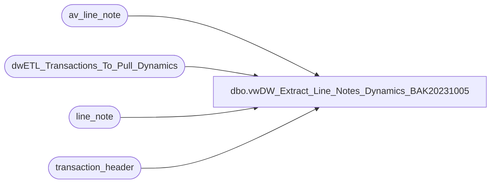

# dbo.vwDW_Extract_Line_Notes_Dynamics_BAK20231005

**Database:** auditworks  
**Server:** bedrockdb01  

## Architecture Diagram



## Table Dependencies

| Referenced Table |
|---|
| av_line_note |
| dwETL_Transactions_To_Pull_Dynamics |
| line_note |
| transaction_header |

## View Code

```sql
---- =====================================================================================================
---- Name: vwDW_Extract_Line_Notes
----
---- Description:	Extract Line Notes from Audit works based upon the
----			transaction numbers loaded into 
----
----
---- Dependencies: None
----
---- Revision History
----		Name:			Date:			Comments:
----		Gary Murrish	4/20/2013		Created
----		Gary Murrish	12/31/2013		Blocked duplicates from Archive
----		Dan Tweedie		07/28/2016		Cast line_note as nvarchar to aid in handling Chinese characters in SSIS load
----		Dan Tweedie		2023-08-08		Derived new line_note by removing 'PRM', 'DM', 'CPN' which are from Jump Mind and not in our coupon dim
----		Tim Callahan	2023-10-05		Added CTE\UNION to Get UK VAT Tax Data from Tax Detail Tables
----										This is due to instances where VAT Tax Line notes did not come through via a non Aptos sales interface
---- =====================================================================================================
CREATE VIEW [dbo].[vwDW_Extract_Line_Notes_Dynamics_BAK20231005]
AS

with 
Prep as
	(
		SELECT
			trig.transaction_id,
			ln.line_id,
			ln.note_type,
			cast(ln.line_note as nvarchar) as line_note
		FROM
			dwETL_Transactions_To_Pull_Dynamics trig WITH (NOLOCK)
			INNER JOIN line_note ln WITH (NOLOCK)
				ON trig.transaction_id = ln.transaction_id
		UNION ALL
		SELECT
			trig.transaction_id,
			ln.line_id,
			ln.note_type,
			cast(ln.line_note as nvarchar) as line_note
		FROM
			dwETL_Transactions_To_Pull_Dynamics trig WITH (NOLOCK)
			INNER JOIN av_line_note ln WITH (NOLOCK)
				ON trig.transaction_id = ln.av_transaction_id
			LEFT JOIN transaction_header th WITH (NOLOCK)
				ON trig.transaction_id = th.transaction_id
			WHERE th.transaction_id IS null		
	)


select
	transaction_id,
	line_id,
	note_type,
	cast(replace(replace(replace(line_note, 'PRM',''), 'DM',''), 'CPN','') as nvarchar) as line_note
from Prep
```

