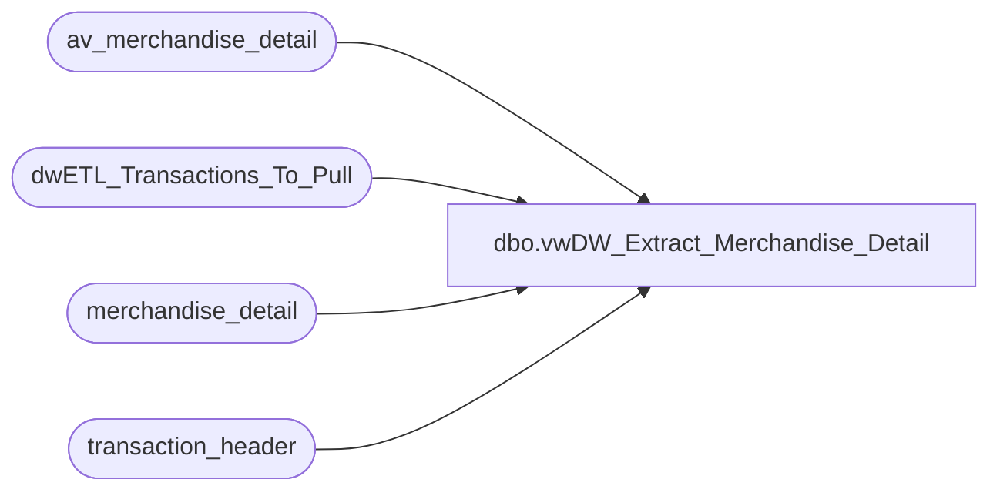

# dbo.vwDW_Extract_Merchandise_Detail

**Database:** auditworks  
**Server:** bedrockdb01  

## Architecture Diagram



## Table Dependencies

| Referenced Table |
|---|
| av_merchandise_detail |
| dwETL_Transactions_To_Pull |
| merchandise_detail |
| transaction_header |

## View Code

```sql
-- =====================================================================================================
-- Name: vwDW_Extract_Merchandise_Detail
--
-- Description:	Extract Merchandise Detail from Audit works based upon the
--			transaction numbers loaded into 
--
--
-- Dependencies: None
--
-- Revision History
--		Name:			Date:			Comments:
--		Gary Murrish	4/20/2013		Created
--		Gary Murrish	12/31/2013		Block duplicates from Archive
-- =====================================================================================================
CREATE VIEW [dbo].[vwDW_Extract_Merchandise_Detail]
AS

SELECT
	trig.transaction_id,
	md.line_id,
	md.upc_no,
	md.units,
	md.sku_id,
	md.style_reference_id,
	md.ticket_price,
	md.sold_at_price,
	md.plu_price
FROM
	dwETL_Transactions_To_Pull trig WITH (NOLOCK)
	INNER JOIN merchandise_detail md WITH (NOLOCK)
		ON md.transaction_id = trig.transaction_id

UNION ALL
SELECT
	trig.transaction_id,
	md.line_id,
	md.upc_no,
	md.units,
	md.sku_id,
	md.style_reference_id,
	md.ticket_price,
	md.sold_at_price,
	md.plu_price
FROM
	dwETL_Transactions_To_Pull trig WITH (NOLOCK)
	INNER JOIN av_merchandise_detail md WITH (NOLOCK)
		ON md.av_transaction_id = trig.transaction_id
	LEFT JOIN transaction_header th WITH (NOLOCK)
		ON trig.transaction_id = th.transaction_id
	WHERE th.transaction_id IS null
```

