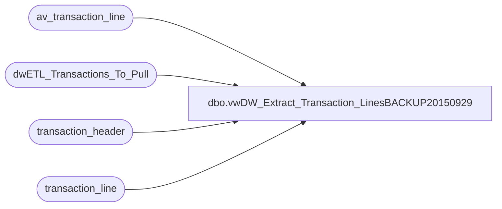

# dbo.vwDW_Extract_Transaction_LinesBACKUP20150929

**Database:** auditworks  
**Server:** bedrockdb01  

## Architecture Diagram



## Table Dependencies

| Referenced Table |
|---|
| av_transaction_line |
| dwETL_Transactions_To_Pull |
| transaction_header |
| transaction_line |

## View Code

```sql
-- =====================================================================================================
-- Name: vwDW_Extract_Transaction_Lines
--
-- Description:	Extract Transaction_lines from Audit works based upon the
--			transaction numbers loaded into 
--
--
-- Dependencies: None
--
-- Revision History
--		Name:			Date:			Comments:
--		Gary Murrish	4/20/2013		Created
--		Gary Murrish	12/31/2013		Block duplicates from Archive
-- =====================================================================================================
CREATE VIEW [dbo].[vwDW_Extract_Transaction_LinesBACKUP20150929]
AS


-- Get the transaction Lines

SELECT
	tl.transaction_id,
	tl.line_id,
	tl.line_sequence,
	tl.line_object_type,
	tl.line_object,
	tl.line_action,
	tl.gross_line_amount,
	tl.pos_discount_amount,
	tl.db_cr_none,
	tl.reference_type,
	tl.reference_no, 
	tl.voiding_reversal_flag
FROM
	dwETL_Transactions_To_Pull trig WITH (NOLOCK)
	INNER JOIN transaction_line tl WITH (NOLOCK)
		ON tl.transaction_id = trig.transaction_id
WHERE
	tl.line_void_flag = 0
UNION ALL
SELECT
	tl.av_transaction_id AS transaction_id,
	tl.line_id,
	tl.line_sequence,
	tl.line_object_type,
	tl.line_object,
	tl.line_action,
	tl.gross_line_amount,
	tl.pos_discount_amount,
	tl.db_cr_none,
	tl.reference_type,
	tl.reference_no, 
	tl.voiding_reversal_flag
FROM
	dwETL_Transactions_To_Pull trig WITH (NOLOCK)
	INNER JOIN av_transaction_line tl WITH (NOLOCK)
		ON tl.av_transaction_id = trig.transaction_id
	LEFT JOIN transaction_header th WITH (NOLOCK)
		ON trig.transaction_id = th.transaction_id
WHERE
	tl.line_void_flag = 0
	AND th.transaction_id IS NULL	-- Blocl duplicates
```

