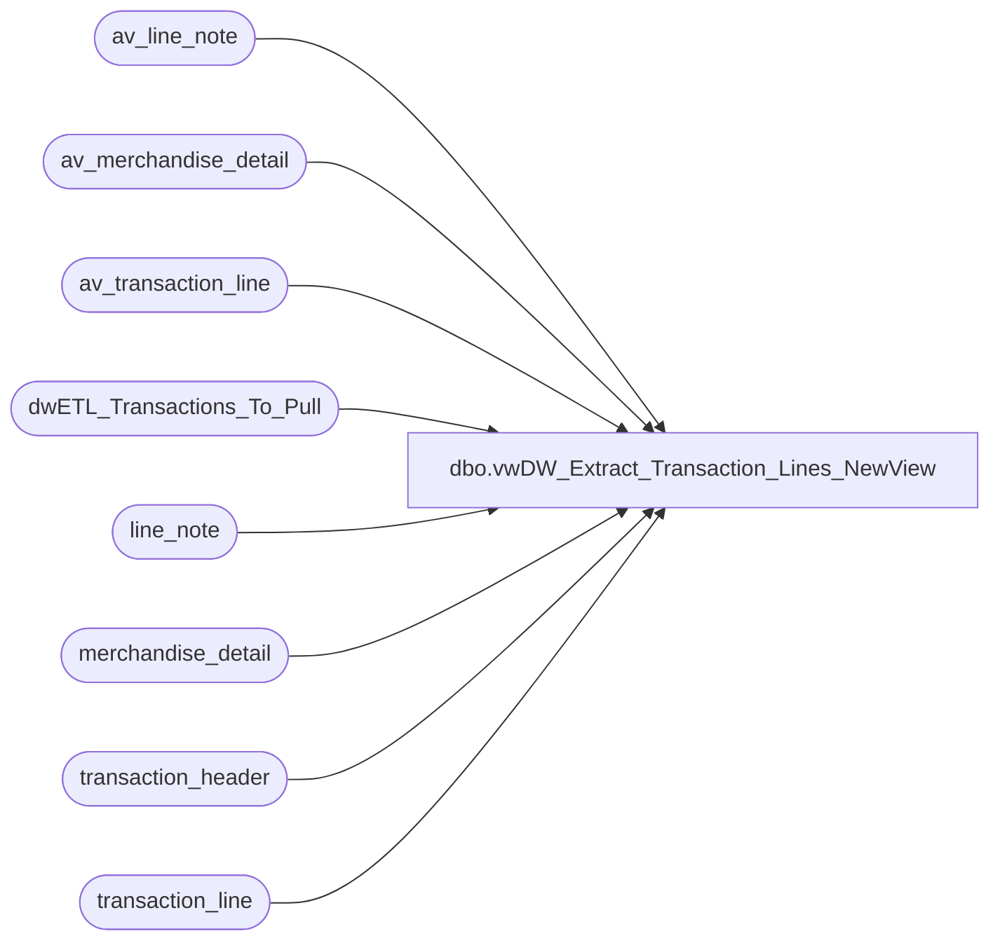

# dbo.vwDW_Extract_Transaction_Lines_NewView

**Database:** auditworks  
**Server:** bedrockdb01  

## Architecture Diagram



## Table Dependencies

| Referenced Table |
|---|
| av_line_note |
| av_merchandise_detail |
| av_transaction_line |
| dwETL_Transactions_To_Pull |
| line_note |
| merchandise_detail |
| transaction_header |
| transaction_line |

## View Code

```sql
CREATE view [dbo].[vwDW_Extract_Transaction_Lines_NewView]

as 


WITH NoChange (transaction_id,line_id,line_sequence,line_object_type,line_object,line_action,gross_line_amount,pos_discount_amount,db_cr_none,reference_type,reference_no,voiding_reversal_flag)
AS (--CREDITCARD#, GIFTCARD#(TENDER), COUPON#(TENDER), PARTYDEPOSIT(TENDER), GIFTCARD#(BEARBUCKS)
	SELECT distinct
		tl.transaction_id,
		tl.line_id,
		tl.line_sequence,
		tl.line_object_type,
		tl.line_object,
		tl.line_action,
		tl.gross_line_amount,
		tl.pos_discount_amount,
		tl.db_cr_none,
		tl.reference_type,
		convert(varchar, tl.reference_no) as reference_no,
		tl.voiding_reversal_flag
	FROM
		dwETL_Transactions_To_Pull trig WITH (NOLOCK)
		INNER JOIN transaction_line tl WITH (NOLOCK) ON tl.transaction_id = trig.transaction_id
	WHERE tl.line_void_flag = 0
	UNION ALL
	SELECT distinct
		tl.av_transaction_id AS transaction_id,
		tl.line_id,
		tl.line_sequence,
		tl.line_object_type,
		tl.line_object,
		tl.line_action,
		tl.gross_line_amount,
		tl.pos_discount_amount,
		tl.db_cr_none,
		tl.reference_type,
		convert(varchar, tl.reference_no) as reference_no,
		tl.voiding_reversal_flag
	FROM
		dwETL_Transactions_To_Pull trig WITH (NOLOCK)
		INNER JOIN av_transaction_line tl WITH (NOLOCK) ON tl.av_transaction_id = trig.transaction_id
		LEFT JOIN transaction_header th WITH (NOLOCK) ON trig.transaction_id = th.transaction_id
	WHERE tl.line_void_flag = 0
		  AND th.transaction_id IS NULL
	),
UPC (transaction_id, line_id, reference_no)
AS ( --UPC NUMBER
	SELECT distinct
		tl.transaction_id,
		tl.line_id,
		convert(varchar, md.upc_no) as reference_no
	FROM
		dwETL_Transactions_To_Pull trig WITH (NOLOCK)
		INNER JOIN transaction_line tl WITH (NOLOCK) ON tl.transaction_id = trig.transaction_id
	join merchandise_detail md with (nolock) on tl.transaction_id = md.transaction_id
		and tl.line_id = md.line_id
	WHERE tl.line_void_flag = 0
	UNION ALL
	SELECT distinct
		tl.av_transaction_id AS transaction_id,
		tl.line_id,
		convert(varchar, md.upc_no) as reference_no
	FROM
		dwETL_Transactions_To_Pull trig WITH (NOLOCK)
		INNER JOIN av_transaction_line tl WITH (NOLOCK) ON tl.av_transaction_id = trig.transaction_id
		LEFT JOIN transaction_header th WITH (NOLOCK) ON trig.transaction_id = th.transaction_id
	join av_merchandise_detail md with (nolock) on tl.av_transaction_id = md.av_transaction_id
		and tl.line_id = md.line_id
	WHERE tl.line_void_flag = 0
		  AND th.transaction_id IS NULL
   ),
Coupon (transaction_id, line_id, reference_no)
AS (--COUPON DISCOUNT DETAIL
	SELECT distinct
		tl.transaction_id,
		tl.line_id,
		--convert(varchar, sum(dd.pos_discount_amount)) as reference_no
		convert(varchar, ln.line_note) as reference_no
	FROM
		dwETL_Transactions_To_Pull trig WITH (NOLOCK)
		JOIN transaction_line tl WITH (NOLOCK) ON tl.transaction_id = trig.transaction_id
		join line_note ln with (nolock) on tl.transaction_id = ln.transaction_id
			and tl.line_id = ln.line_id
			and ln.note_type = '9006'
	WHERE
		tl.line_void_flag = 0
	UNION ALL
	SELECT distinct
		tl.av_transaction_id AS transaction_id,
		tl.line_id,
		convert(varchar, ln.line_note) as reference_no
	FROM
		dwETL_Transactions_To_Pull trig WITH (NOLOCK)
		JOIN av_transaction_line tl WITH (NOLOCK) ON tl.av_transaction_id = trig.transaction_id
		LEFT JOIN transaction_header th WITH (NOLOCK) ON trig.transaction_id = th.transaction_id
		join av_line_note ln with (nolock) on tl.av_transaction_id = ln.av_transaction_id
		and tl.line_id = ln.line_id
		and ln.note_type = '9006'
	WHERE tl.line_void_flag = 0
		  AND th.transaction_id IS NULL
   ),
Merchandise (transaction_id, line_id, reference_no)
AS (--MERCHANDISE CONTRIBUTION
	SELECT distinct
		tl.transaction_id,
		tl.line_id,
		convert(varchar, ln.line_note) as reference_no
	FROM
		dwETL_Transactions_To_Pull trig WITH (NOLOCK)
		INNER JOIN transaction_line tl WITH (NOLOCK)
			ON tl.transaction_id = trig.transaction_id
	join line_note ln with (nolock) on tl.transaction_id = ln.transaction_id
		and tl.line_id = ln.line_id
		and ln.note_type = '39'
	WHERE
		tl.line_void_flag = 0
	UNION ALL
	SELECT distinct
		tl.av_transaction_id AS transaction_id,
		tl.line_id,
		convert(varchar, ln.line_note) as reference_no
	FROM
		dwETL_Transactions_To_Pull trig WITH (NOLOCK)
		INNER JOIN av_transaction_line tl WITH (NOLOCK)
			ON tl.av_transaction_id = trig.transaction_id
		LEFT JOIN transaction_header th WITH (NOLOCK)
			ON trig.transaction_id = th.transaction_id
	join av_line_note ln with (nolock) on tl.av_transaction_id = ln.av_transaction_id
		and tl.line_id = ln.line_id
		and ln.note_type = '39'
	WHERE
		tl.line_void_flag = 0
		AND th.transaction_id IS NULL 
   ),
Promo (transaction_id, line_id, reference_no)
AS (--PROMO DESCRIPTION
	SELECT distinct
		tl.transaction_id,
		tl.line_id,
		convert(varchar, ln.line_note) as reference_no
	FROM
		dwETL_Transactions_To_Pull trig WITH (NOLOCK)
		INNER JOIN transaction_line tl WITH (NOLOCK)
			ON tl.transaction_id = trig.transaction_id
	join line_note ln with (nolock) on tl.transaction_id = ln.transaction_id
		and tl.line_id = ln.line_id
		and ln.note_type = '20'
	WHERE
		tl.line_void_flag = 0
	UNION ALL
	SELECT distinct
		tl.av_transaction_id AS transaction_id,
		tl.line_id,
		convert(varchar, ln.line_note) as reference_no
	FROM
		dwETL_Transactions_To_Pull trig WITH (NOLOCK)
		INNER JOIN av_transaction_line tl WITH (NOLOCK)
			ON tl.av_transaction_id = trig.transaction_id
		LEFT JOIN transaction_header th WITH (NOLOCK)
			ON trig.transaction_id = th.transaction_id
	join av_line_note ln with (nolock) on tl.av_transaction_id = ln.av_transaction_id
		and tl.line_id = ln.line_id
		and ln.note_type = '20'
	WHERE
		tl.line_void_flag = 0
		AND th.transaction_id IS NULL 
   ),
TaxExempt (transaction_id, line_id, reference_no)
AS ( -- TAX EXEMPT
	SELECT distinct
		tl.transaction_id,
		tl.line_id,
		convert(varchar, ln.line_note) as reference_no
	FROM
		dwETL_Transactions_To_Pull trig WITH (NOLOCK)
		INNER JOIN transaction_line tl WITH (NOLOCK)
			ON tl.transaction_id = trig.transaction_id
	join line_note ln with (nolock) on tl.transaction_id = ln.transaction_id
		and tl.line_id = ln.line_id
		and ln.note_type = '38'
	WHERE
		tl.line_void_flag = 0
	UNION ALL
	SELECT distinct
		tl.av_transaction_id AS transaction_id,
		tl.line_id,
		convert(varchar, ln.line_note) as reference_no
	FROM
		dwETL_Transactions_To_Pull trig WITH (NOLOCK)
		INNER JOIN av_transaction_line tl WITH (NOLOCK)
			ON tl.av_transaction_id = trig.transaction_id
		LEFT JOIN transaction_header th WITH (NOLOCK)
			ON trig.transaction_id = th.transaction_id
	join av_line_note ln with (nolock) on tl.av_transaction_id = ln.av_transaction_id
		and tl.line_id = ln.line_id
		and ln.note_type = '38'
	WHERE
		tl.line_void_flag = 0
		AND th.transaction_id IS NULL
   ),
Summary (transaction_id,line_id,line_sequence,line_object_type,line_object,line_action,gross_line_amount,pos_discount_amount,db_cr_none,reference_type,reference_no,voiding_reversal_flag)
AS (
	select distinct 
			a.transaction_id,
			a.line_id,
			a.line_sequence,
			a.line_object_type,
			a.line_object,
			a.line_action,
			a.gross_line_amount,
			a.pos_discount_amount,
			a.db_cr_none,
			a.reference_type,
		   --isnull(a.reference_no, isnull(isnull(isnull(isnull(right('000000' + b.reference_no, 6), c.reference_no), d.reference_no), e.reference_no), f.reference_no)) as reference_no,
		   --coalesce(nullif(a.reference_no, ''), 
					--nullif(right('000000' + b.reference_no, 6), ''),
					--nullif(c.reference_no, ''),
					--nullif(d.reference_no, ''),
					--nullif(e.reference_no, ''),
					--nullif(f.reference_no, '') ) as reference_no,
			coalesce(nullif(a.reference_no, ''), 
					nullif(right('000000' + b.reference_no, 6), ''),
					nullif(e.reference_no, ''),
					nullif(f.reference_no, ''),
					nullif(d.reference_no, ''),
					nullif(c.reference_no, '')
					) as reference_no,
		   a.voiding_reversal_flag
	from  NoChange a
	left join UPC b on a.transaction_id = b.transaction_id and a.line_id = b.line_id
	left join Coupon c on a.transaction_id = c.transaction_id and a.line_id = c.line_id
	left join Merchandise d on a.transaction_id = d.transaction_id and a.line_id = d.line_id
	left join Promo e on a.transaction_id = e.transaction_id and a.line_id = e.line_id
	left join TaxExempt f on  a.transaction_id = f.transaction_id and a.line_id = f.line_id
   )
SELECT *
from Summary
```

