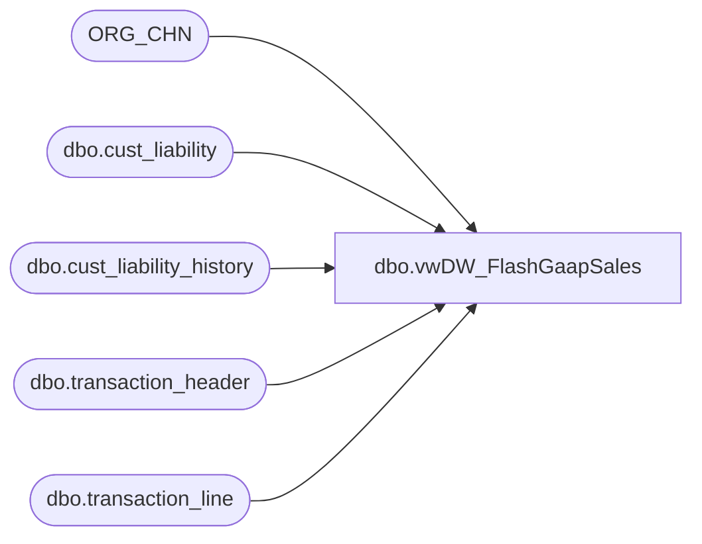

# dbo.vwDW_FlashGaapSales

**Database:** auditworks  
**Server:** bedrockdb01  

## Architecture Diagram



## Table Dependencies

| Referenced Table |
|---|
| ORG_CHN |
| dbo.cust_liability |
| dbo.cust_liability_history |
| dbo.transaction_header |
| dbo.transaction_line |

## View Code

```sql
CREATE view [dbo].[vwDW_FlashGaapSales] as

--==================================================================================================
--	Author			Date			Details
--	Dan Tweedie		09/29/2016		Used by FlashGaapSales SSIS package 
--==================================================================================================

with 
ESRef as 
(
	select 
		cl.reference_no,
		cl.issuing_store_no
	from auditworks.dbo.cust_liability cl with (nolock)
	join auditworks.dbo.cust_liability_history clh with (nolock) 
		on cl.reference_no = clh.reference_no
		and cl.issuing_store_no = clh.store_no
		and cl.date_issued = clh.transaction_date
	where cl.reference_type = 7 --enterprise selling
	and datediff(dd, cl.date_issued, getdate()) <= 90
	group by 
		cl.reference_no,
		cl.issuing_store_no
),
Gaap as 
(
	SELECT  isnull(es.issuing_store_no, h.store_no) AS StoreNo,
				cast(h.entry_date_time as date) as TransactionDate,
				datepart(hh, entry_date_time) as TransactionHour,
			( SUM(( (l.gross_line_amount - l.pos_discount_amount) )
					  * l.db_cr_none * l.voiding_reversal_flag) ) * -1
			AS NetSales,
			count(distinct h.transaction_id) TransactionCount,
			cast(OC.DFLT_CRNCY_CODE AS CHAR(3)) AS CurrencyCode,
			--sum(md.units) as NetUnits
			0 as NetUnits
	FROM    auditworks.dbo.transaction_header h with (nolock)
			JOIN auditworks.dbo.transaction_line l with (nolock) ON h.transaction_id = l.transaction_id
			left join ESRef es on l.reference_no COLLATE Latin1_General_CI_AS = es.reference_no COLLATE Latin1_General_CI_AS
			left JOIN ORG_CHN OC WITH (NOLOCK) ON h.store_no = OC.ORG_CHN_NUM
			--join merchandise_detail md with (nolock) on h.transaction_id = md.transaction_id
	WHERE   ( h.transaction_date >= getdate()-3
				AND h.transaction_void_flag = 0
				AND l.line_void_flag = 0 )
		AND 
				(
					(h.transaction_category IN (1, 2) AND l.line_object_type <> 12 and h.transaction_series <> 'C' and l.line_action <> 95) --exc
						OR 
					(h.transaction_category IN (10) AND (l.line_object_type = 7 OR l.line_object BETWEEN 700 AND 799) and h.transaction_series <> 'C')
						OR
					(h.transaction_category = 242 and 
							(
								(l.line_object = 106 and l.line_action in (90,99,142)) --es fulfillments
									or
								(l.line_object in (200, 203) and line_action = 97) --es shipping on fulfillment
							
							)
								and h.transaction_series = 'C')  --es fulfillments, returns (technically this is customer liability, which is how es fulfillments post
				)
				
			AND NOT (h.store_no = 13 AND h.register_no = 3 AND transaction_date <= '1/31/2012')
			AND 
				(
					l.line_object IN (100, 102, 103, 104, 200, 202, 203, 204, 206, 210, 250, 290, 291, 293, 295, 296, 623, 640, 690, 691, 1630, 1631, 1199, 115, 215, 1660) 
					OR 
					(l.line_object = 106 and line_action in (90,142,99) )
				)
	GROUP BY 
		isnull(es.issuing_store_no, h.store_no), 
		cast(h.entry_date_time as date),
		datepart(hh, h.entry_date_time),
		cast(OC.DFLT_CRNCY_CODE AS CHAR(3))
),
NetWithVat as 
(
	select 
		StoreNo,
		TransactionDate,
		TransactionHour,
		sum(NetSales) as NetSales,
		sum(TransactionCount) as TransactionCount,
		CurrencyCode,
		sum(NetUnits) as NetUnits
	from Gaap
	group by 
		StoreNo,
		TransactionDate,
		TransactionHour,
		CurrencyCode
)
	select
		StoreNo,
		TransactionDate,
		TransactionHour,
		cast(CASE
				WHEN CAST(StoreNo AS INT) between 3000 and 3999 --China
					THEN NetSales / 1.1700

				WHEN CAST(StoreNo as INT) IN (2036, 2054) -- Ireland
					THEN NetSales / 1.2100

				WHEN CAST(StoreNo as INT) = 2301 --Denmark
					THEN NetSales / 1.2500

				WHEN CAST(StoreNo AS INT) >= 2000 and CAST(StoreNo AS INT) <> 2013  -- UK
					THEN NetSales / 1.175

				ELSE NetSales --All Others
					END as decimal(38,2)) 
				AS NetSales,
		TransactionCount,
		NetUnits,
		'Auditworks' as Source,
		CurrencyCode
	from NetWithVat
```

