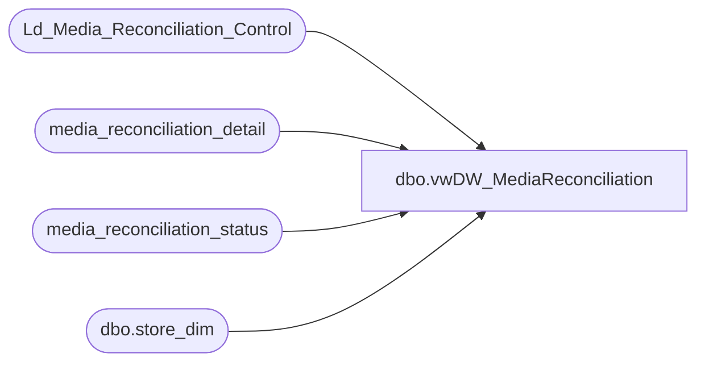

# dbo.vwDW_MediaReconciliation

**Database:** auditworks  
**Server:** bedrockdb01  

## Architecture Diagram



## Table Dependencies

| Referenced Table |
|---|
| Ld_Media_Reconciliation_Control |
| media_reconciliation_detail |
| media_reconciliation_status |
| dbo.store_dim |

## View Code

```sql
CREATE VIEW [dbo].[vwDW_MediaReconciliation]
AS

/**********************************************************
View: vwDW_MediaReconciliation
Purpose: Used as source for WF_MediaReconciliation.dtsx

History: 
08/29/2011	Trista Parmentier	Created view using logic from Informatica workflow, wf_Media_Reconciliation_Daily 
09/29/2011	Trista Parmentier	Removed unused logic. It appears the process was originally designed for all 
								transaction types, but now it only reports on DP transaction types. There was logic
								filtering data by line objects which was irrelevant if only reporting DP types
7/31/2012	Keith Missey		updated with line object 9007
**********************************************************/


--SELECT * FROM vwDW_MediaReconciliation

/*
The job is scheduled to run daily on Tuesday through Friday at 9:00 pm. If a store exists in the auditworks.dbo.Ld_Media_Reconciliation_Control  (mrc) table, data will be included for dates between mrc.transaction_date  and 2 days ago. If a store does not exist in mrc, all data for dates 2 days ago and prior will be included. The mrc table is updated with the process date and the last data date.									
Example									
Process Date (@9pm)	    Data includes				 Chesapeake Loads							
Tues, Sept 27, 2011	    Thurs, Sept 22 – Sun, Sept 25	 Wed, Sept 28							
Wed, Sept 28, 2011	    Mon, Sept 26				 Thurs, Sept 29							
Thurs, Sept 29, 2011    Tues, Sept 27				 Fri, Sept 30							
Fri, Sept 30, 2011	    Wed, Sept 28				 Mon, Oct 3							
									
Accounting loads this file into Chesapeake on the following business day. If there is an issue with the file they will request it be recreated. To recreate the file, the following must be done:									
·         If the process needs to be rerun, ask Accounting the following questions:									
1.       Which file do we need to recreate? Most likely it will be the last file created. This will be @processdate for our script below.									
2.       What date range should be included in that file?  The minimum date of this range will be @datadate in our script below. The maximum date of this range will be needed in a later step.									
Update the following script with @processdate (from #1 above) and @datadate (from #2 above) and execute on the audiworks database. This will update the values in the control table so the correct dates will be included in the file. 									

DECLARE @processdate DATETIME
DECLARE @datadate DATETIME

SET @processdate = '5/15/2014' --response from #1 above
SET @datadate = '5/24/2014' --min date from response from #2 above

UPDATE dbo.Ld_Media_Reconciliation_Control
SET transaction_date = DATEADD(d,-1,@datadate) /*updating transaction_date to the day before @datedate as that represents the last SUCCESSFUL data date. This date WILL NOT be included in our file.*/
WHERE process_date >= @processdate

*/


WITH DetailCTE 
AS (SELECT d.store_no,
		d.transaction_date, 
		d.register_no, 
		d.line_object, 
		CAST(d.rec_amount AS DECIMAL(10,4)) AS amount
	FROM media_reconciliation_detail d
	INNER JOIN media_reconciliation_status s ON
		d.store_no = s.store_no
		AND d.balancing_entity_id = s.balancing_entity_id
	INNER JOIN PAPAMART.dw.dbo.store_dim sd ON
		d.store_no = sd.store_id
	INNER JOIN Ld_Media_Reconciliation_Control c ON
		d.store_no = c.store_no
	WHERE line_action = 247
		AND s.rec_type IN (10,20,21)
		AND d.line_object  IN (600,601,602,619,625, 9007)
		AND d.transaction_date > CASE WHEN ISNULL(c.transaction_date,'') = '' THEN DATEADD(d,-31,GETDATE()) ELSE c.transaction_date END 
		AND d.transaction_date <= DATEADD(d,-2,GETDATE()) 
		--AND d.transaction_date BETWEEN '5/14/2014' and '5/21/2014'
		/*the uncomment when rerunning this for prior days*/
		)

SELECT d.store_no,
	d.transaction_date,
	CAST(CONVERT(VARCHAR(12),GETDATE(),101) AS DATETIME) AS process_date,
	'm_media_reconciliation_file' AS process_name,	
	SUM(d.amount) AS AmountLog,
--The following columns are formatted with padding for the fixed width export file	
	CAST('D' AS CHAR(1)) AS RecordType,
	CAST(RIGHT(REPLICATE('0',4) + CAST(d.store_no AS VARCHAR),4) AS CHAR(35)) AS ImportAccountID,
	CAST(CONVERT(VARCHAR(8),GETDATE(),112) AS CHAR(8)) AS PostDate,
	CAST(CONVERT(VARCHAR(8),d.transaction_date,112) AS CHAR(8)) AS EffectiveDate,
	CAST('DP' AS NCHAR(2)) AS TransactionType,
	CAST(CASE WHEN SUM(amount) < 0 THEN 'C' ELSE 'D' END AS CHAR(1)) AS DebitCredit,
	REPLICATE('0',11) + SUBSTRING(CAST((1000000000000 + (SUM(amount)*100000)) AS CHAR),2,12) AS Amount,
	CAST(RIGHT(REPLICATE('0',4) + CAST(d.store_no AS VARCHAR),4) AS CHAR(4)) AS Reference1,
	CAST('' AS CHAR(16)) AS Reference2,
	CAST('' AS CHAR(16)) AS Reference3,
	CAST('' AS CHAR(16)) AS Reference4,
	CAST('' AS CHAR(16)) AS Reference5,
	CAST('' AS CHAR(40)) AS Details
FROM DetailCTE d
GROUP BY d.store_no,
	d.transaction_date
```

