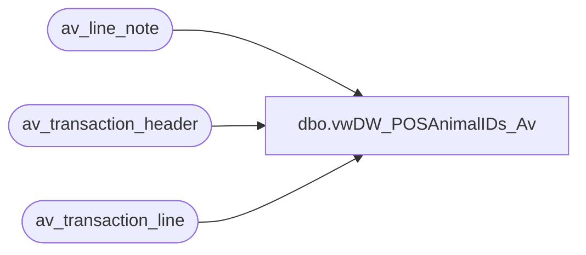

# dbo.vwDW_POSAnimalIDs_Av

**Database:** auditworks  
**Server:** bedrockdb01  

## Architecture Diagram



## Table Dependencies

| Referenced Table |
|---|
| av_line_note |
| av_transaction_header |
| av_transaction_line |

## View Code

```sql
CREATE VIEW [dbo].[vwDW_POSAnimalIDs_Av]
AS


WITH 
AnimalIDs as
	(
		--SELECT        MAX(ln.transaction_id) as transaction_id, CAST(ln.line_note as varchar(4000)) AS animal_id
		--FROM            dbo.line_note ln with (nolock)
		--INNER JOIN transaction_header th with (nolock)
		--	ON ln.transaction_id = th.transaction_id
		--INNER JOIN transaction_line tl with (nolock)
		--	ON ln.transaction_id = tl.transaction_id  AND ln.line_id = tl.line_id
		--WHERE        (ln.note_type = 6) AND left(ln.line_note,5) <> '00000'
		--AND tl.line_void_flag = 0
		--AND tl.line_action = 1
		--AND th.transaction_void_flag = 0
		--GROUP BY CAST(line_note as varchar(4000))
		--UNION
		SELECT        MAX(ln.av_transaction_id) as transaction_id, CAST(ln.line_note as varchar(4000)) AS animal_id
		FROM  av_line_note ln with (nolock)
		INNER JOIN av_transaction_header th with (nolock)
			ON ln.av_transaction_id = th.av_transaction_id
		INNER JOIN av_transaction_line tl with (nolock)
			ON ln.av_transaction_id = tl.av_transaction_id  AND ln.line_id = tl.line_id
		WHERE        (ln.note_type = 6) AND left(ln.line_note,5) <> '00000'
		AND tl.line_void_flag = 0
		AND tl.line_action = 1
		AND th.transaction_void_flag = 0
		and th.transaction_date >= dateadd(dd, -1582, getdate()) 
		and store_no > 468 and store_no < 603
		GROUP BY CAST(line_note as varchar(4000))
	),
TransactionIDs as
	(
		select max(a.transaction_id) transaction_id, cast(a.animal_id as varchar(4000)) animal_id
		from AnimalIDs a 
		group by cast(a.animal_id as varchar(4000))
	)
--select t.transaction_id, cast(t.animal_id as varchar(4000)) animal_id, cast(th.transaction_date as date) TransactionDate
--from TransactionIDs t
--join transaction_header th with (nolock) on t.transaction_id = th.transaction_id 
--UNION
select t.transaction_id, cast(t.animal_id as varchar(4000)) animal_id, cast(ath.transaction_date as date) TransactionDate
from TransactionIDs t
join av_transaction_header ath with (nolock) on t.transaction_id = ath.av_transaction_id
```

