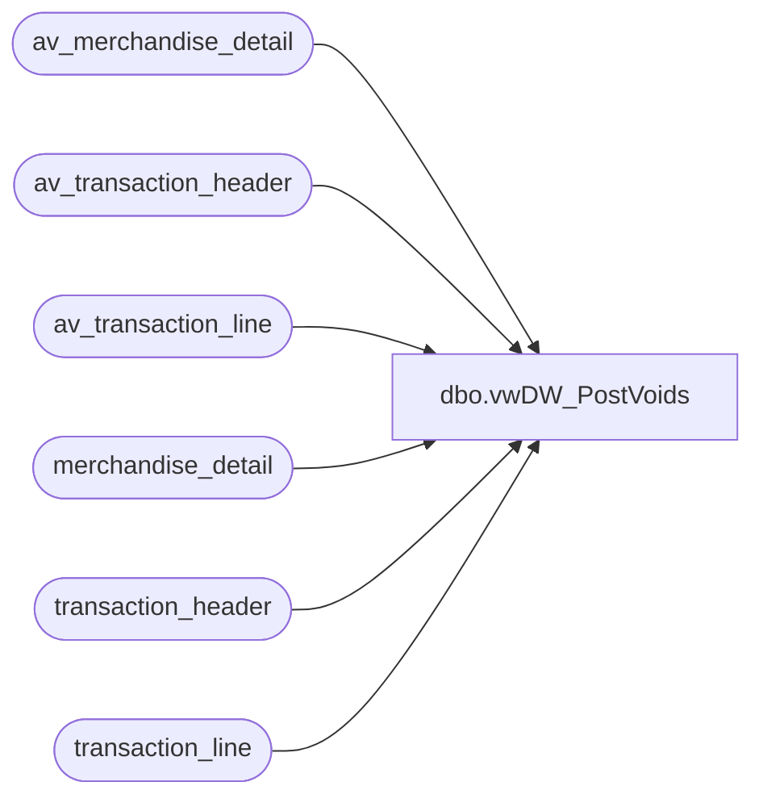

# dbo.vwDW_PostVoids

**Database:** auditworks  
**Server:** bedrockdb01  

## Architecture Diagram



## Table Dependencies

| Referenced Table |
|---|
| av_merchandise_detail |
| av_transaction_header |
| av_transaction_line |
| merchandise_detail |
| transaction_header |
| transaction_line |

## View Code

```sql
CREATE view [dbo].[vwDW_PostVoids]

as

-------------------------------------------------------------------------------------------------
--	Dan Tweedie	2018-03-05	-	Created view to capture post voids from past 1000 days for Domo	-
--								Tests show the query runs in 12 seconds
-------------------------------------------------------------------------------------------------

WITH 
Transactions as
	(
		SELECT
			th.transaction_id,
			th.store_no,
			th.transaction_date,
			th.tender_total,
			th.transaction_category,
			th.transaction_series
		FROM
			transaction_header th WITH (NOLOCK)
		WHERE 1=1
			and th.transaction_date >= getdate()-1000
			AND th.transaction_series IN ('P', '', 'D', 'F', 'W', 'A', 'C')
			AND th.transaction_void_flag = 5
			AND th.transaction_category IN (1, 2, 10, 242)
			AND NOT (th.store_no = 13 AND th.register_no = 3 AND th.transaction_date <= '1/31/2012') 
		UNION
		SELECT
			th.av_transaction_id,
			th.store_no,
			th.transaction_date,
			th.tender_total,
			th.transaction_category,
			th.transaction_series
		FROM
			av_transaction_header th WITH (NOLOCK)
		WHERE 1=1
			and th.transaction_date >= getdate()-1000
			AND th.transaction_series IN ('P', '', 'D', 'F', 'W', 'A', 'C') 
			AND th.transaction_void_flag = 5
			AND th.transaction_category IN (1, 2, 10, 242) 
			AND NOT (th.store_no = 13 AND th.register_no = 3 AND th.transaction_date <= '1/31/2012') 
	),
HasLineObjects as
	(
		SELECT
			t.transaction_id
		FROM
			Transactions t WITH (NOLOCK)
			INNER JOIN transaction_line tl WITH (NOLOCK)
				ON t.transaction_id = tl.transaction_id
		WHERE
			(t.transaction_category IN (1, 2) AND tl.line_object_type <> 12 and t.transaction_series <> 'C')
			OR 
			(t.transaction_category IN (10) AND (tl.line_object_type = 7 OR tl.line_object BETWEEN 700 AND 799) and t.transaction_series <> 'C')
			OR
			(t.transaction_category = 242 and tl.line_object = 106 and tl.line_action in (8,90,99) and t.transaction_series = 'C')  --new to include shipment cancels, fulfillments, returns
		GROUP BY t.transaction_id
		UNION
		SELECT
			t.transaction_id
		FROM
			Transactions t WITH (NOLOCK)
			INNER JOIN av_transaction_line tl WITH (NOLOCK)
				ON t.transaction_id = tl.av_transaction_id
		WHERE
			(t.transaction_category IN (1, 2) AND tl.line_object_type <> 12 and t.transaction_series <> 'C')
			OR 
			(t.transaction_category IN (10) AND (tl.line_object_type = 7 OR tl.line_object BETWEEN 700 AND 799) and t.transaction_series <> 'C')
			OR 
			(t.transaction_category = 242 and tl.line_object = 106 and tl.line_action in (8,90,99) and t.transaction_series = 'C')  --new to include shipment cancels, fulfillments, returns
		GROUP BY t.transaction_id
	),
TransUnits as
	(
		select 
			t.transaction_id,
			sum(md.units) Units
		from merchandise_detail md 
		join Transactions t on md.transaction_id = t.transaction_id
		join HasLineObjects h on t.transaction_id = h.transaction_id
		group by t.transaction_id
		UNION
		select 
			t.transaction_id,
			sum(md.units) Units
		from av_merchandise_detail md 
		join Transactions t on md.av_transaction_id = t.transaction_id
		join HasLineObjects h on t.transaction_id = h.transaction_id
		group by t.transaction_id
	)
select 
	cast(th.transaction_date as date) TransactionDate,
	right(concat(cast('0000' as varchar), cast(th.store_no as varchar)),4) as StoreNo,
	sum(th.tender_total) as PostVoidUGA,
	sum(tu.Units) as PostVoidUnits
from Transactions th
join TransUnits tu on th.transaction_id = tu.transaction_id
group by 
	cast(th.transaction_date as date),
	right(concat(cast('0000' as varchar), cast(th.store_no as varchar)),4)
```

