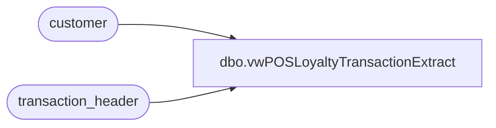

# dbo.vwPOSLoyaltyTransactionExtract

**Database:** auditworks  
**Server:** bedrockdb01  

## Architecture Diagram



## Table Dependencies

| Referenced Table |
|---|
| customer |
| transaction_header |

## View Code

```sql
CREATE view [dbo].[vwPOSLoyaltyTransactionExtract]

as

with
Trans as
	(
		select 
			cast(max(c.customer_no) as varchar(20)) as customer_no,
			c.transaction_id
		from customer c with (nolock) 
		where 1=1
		and c.customer_role in (1,204) 
		and c.customer_no is not null
		and c.customer_no<>'0'
		group by 
			c.transaction_id
	),
Tranz as
	(
		select 
			t.customer_no,
			t.transaction_id
		from Trans t
		join customer c 
			on t.transaction_id=c.transaction_id
			and t.customer_no=c.customer_no
			and c.customer_role in (1,204) 
			and c.customer_no is not null
			and c.customer_no<>'0'
		join transaction_header th on t.transaction_id=th.transaction_id
		where 1=1
		group by 
			t.customer_no,
			t.transaction_id
	
	)
select
	t.customer_no as CustomerNumber,
	cast(t.transaction_id as int) as SATransactionID,
	NULL as LoyaltyTransactionType,
	0 as matchedByEMail
from Tranz t 
--join PAPAMART.dw.dbo.CRMCustomerDim cd on t.customer_no collate SQL_Latin1_General_CP1_CI_AS  =cd.CustomerNumber
group by 
	t.customer_no,
	cast(t.transaction_id as int)
```

