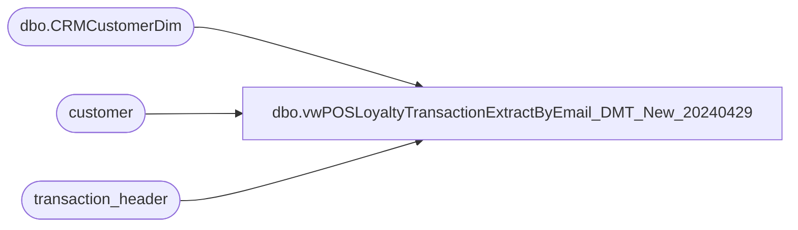

# dbo.vwPOSLoyaltyTransactionExtractByEmail_DMT_New_20240429

**Database:** auditworks  
**Server:** bedrockdb01  

## Architecture Diagram



## Table Dependencies

| Referenced Table |
|---|
| dbo.CRMCustomerDim |
| customer |
| transaction_header |

## View Code

```sql
CREATE view [dbo].[vwPOSLoyaltyTransactionExtractByEmail_DMT_New_20240429]

--gets customers with customer number not in CRMCustomerDim, but the email address IS in CRMCustomerDim so we use that person's CustomerNumber
as
with
Trans as
	(
		select
			c.email_address,
			c.transaction_id
		from customer c with (nolock)
		join transaction_header th on c.transaction_id=th.transaction_id
		where 1=1
		and c.customer_role in (1,4)
		and th.store_no in (13,2013)
		--and c.customer_no=0
		and c.email_address not like '%@marketplace.amazon%'
		and not exists (select cd.CustomerNumber from PAPAMART.dw.dbo.CRMCustomerDim cd 
							where cd.CustomerNumber collate SQL_Latin1_General_CP1_CI_AS = c.customer_no)
		group by
			c.email_address,
			c.transaction_id
	)
select
	max(cd.CustomerNumber) as CustomerNumber,
	--x.transaction_id as SATransactionID,
	cast(x.transaction_id as int) as SATransactionID,
	NULL as LoyaltyTransactionType,
	1 as matchedByEMail
from Trans x
join PAPAMART.dw.dbo.CRMCustomerDim cd on x.email_address collate SQL_Latin1_General_CP1_CI_AS  =cd.EmailAddress
group by transaction_id
```

