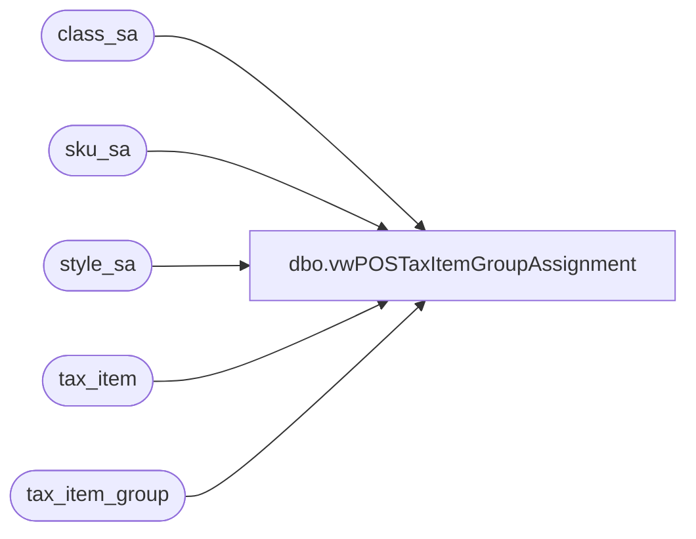

# dbo.vwPOSTaxItemGroupAssignment

**Database:** auditworks  
**Server:** bedrockdb01  

## Architecture Diagram



## Table Dependencies

| Referenced Table |
|---|
| class_sa |
| sku_sa |
| style_sa |
| tax_item |
| tax_item_group |

## View Code

```sql
create view vwPOSTaxItemGroupAssignment 

as 

SELECT  
    cast(s.style_code as varchar(6)) as StyleCode,
	ti.tax_item_group_id,
    ti.tax_item_group_code,
    ti.tax_item_group_description,
	c.class_description,
	c.class_short_description
FROM  style_sa s
    join class_sa c 
        on s.upc_lookup_division=c.upc_lookup_division
        AND  s.class_code=c.class_code
    join tax_item u 
        on s.upc_lookup_division=u.upc_lookup_division
        and s.style_reference_id = u.style_reference_id
   join sku_sa sku 
        on u.upc_lookup_division=sku.upc_lookup_division
        and u.sku_id=sku.sku
    join tax_item_group ti on isnull(c.tax_item_group_id,10)=ti.tax_item_group_id
group by 
	s.style_code,
	ti.tax_item_group_id,
    ti.tax_item_group_code,
    ti.tax_item_group_description,
	c.class_description,
	c.class_short_description
```

