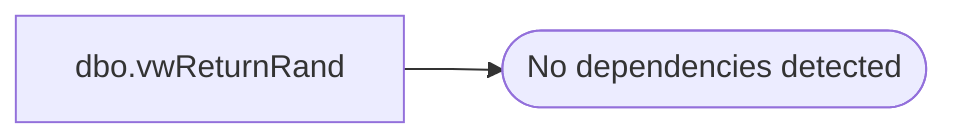

# dbo.vwReturnRand

**Database:** auditworks  
**Server:** bedrockdb01  

## Architecture Diagram



## Table Dependencies

_No table dependencies detected._

## View Code

```sql
CREATE VIEW [dbo].[vwReturnRand]
WITH SCHEMABINDING
AS
SELECT     RAND() AS r
```

