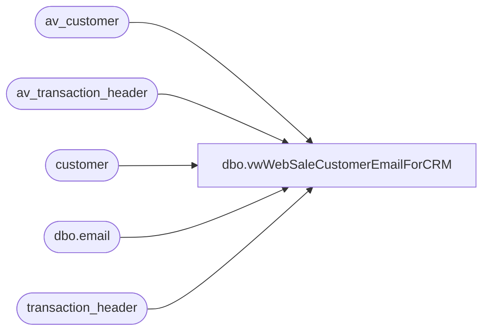

# dbo.vwWebSaleCustomerEmailForCRM

**Database:** auditworks  
**Server:** bedrockdb01  

## Architecture Diagram



## Table Dependencies

| Referenced Table |
|---|
| av_customer |
| av_transaction_header |
| customer |
| dbo.email |
| transaction_header |

## View Code

```sql
CREATE view [dbo].[vwWebSaleCustomerEmailForCRM]


--=========================================================================================================================================
--	Dan Tweedie	2019-09-06	-	 Created view to query customers with email address in a US web sale transaction with following criteria
--									- has a sale transaction for store 13
--									- customer's country is not GBR
--									- customer role is 1, which is Purchaser
--									- email address is not a buildabear.com email
--								Output of view will run through SSIS to do a lookup to CRM and if the email address is NOT in CRM,
--									the data will flow into a file to be imported into CRM as a Customer
--=========================================================================================================================================
as

with
MaxTranStage as ---get email's most recent transaction from store 13
	(
		select 
			max(th.transaction_id) MaxTransactionID,
			c.email_address
		from customer c with (nolock) 
		join transaction_header th with (nolock) on c.transaction_id=th.transaction_id
		where th.store_no = 13
		and isnull(c.country, 'xx') <> 'GBR'
		and c.customer_role=1 --purchasing customer
		and c.email_address not like '%buildabear.co%'
		and datediff(dd, th.transaction_date, getdate())<=1
		--and cast(th.transaction_date as date) >= '2018-11-01'
		group by c.email_address
		UNION
		select 
			max(th.av_transaction_id) MaxTransactionID,
			c.email_address
		from av_customer c with (nolock) 
		join av_transaction_header th with (nolock) on c.av_transaction_id=th.av_transaction_id
		where th.store_no = 13
		and isnull(c.country, 'xx') <> 'GBR'
		and c.customer_role=1 --purchasing customer
		and c.email_address not like '%buildabear.co%'
		and datediff(dd, th.transaction_date, getdate())<=1
		--and cast(th.transaction_date as date) >= '2018-11-01'
		group by c.email_address
	),
MaxTran as
	(
		select 
			max(MaxTransactionID) as MaxTransactionID,
			email_address
		from MaxTranStage 
		group by email_address
	),
Summary as
	(
		select 
			c.email_address COLLATE Latin1_General_CI_AS as email_address,
			c.first_name,	
			c.last_name,	
			c.address_1,	
			c.address_2,	
			c.city,	
			c.state,
			c.post_code,	
			'USA' as country,	
			c.telephone_no1,
			0 as PhoneTxtOptIn,--opt-out to sms msg,
			c.transaction_id
		from customer c with (nolock) 
		join transaction_header th with (nolock) on c.transaction_id=th.transaction_id
		join MaxTran et 
			on th.transaction_id=et.MaxTransactionID 
			and c.email_address=et.email_address
		where th.store_no = 13
		and isnull(c.country, 'xx') <> 'GBR'
		and c.customer_role=1 --purchasing customer
		and c.email_address not like '%buildabear.co%'
		and datediff(dd, th.transaction_date, getdate())<=1
		--and cast(th.transaction_date as date) >= '2018-11-01'
		UNION
		select 
			c.email_address COLLATE Latin1_General_CI_AS as email_address,
			c.first_name,	
			c.last_name,	
			c.address_1,	
			c.address_2,	
			c.city,	
			c.state,
			c.post_code,	
			'USA' as country,	
			c.telephone_no1,
			0 as PhoneTxtOptIn,--opt-out to sms msg
			c.av_transaction_id
		from av_customer c with (nolock) 
		join av_transaction_header th with (nolock) on c.av_transaction_id=th.av_transaction_id
		join MaxTran et 
			on th.av_transaction_id=et.MaxTransactionID 
			and c.email_address=et.email_address
		where th.store_no = 13
		and isnull(c.country, 'xx') <> 'GBR'
		and c.customer_role=1 --purchasing customer
		and c.email_address not like '%buildabear.co%'
		and datediff(dd, th.transaction_date, getdate())<=1
		--and cast(th.transaction_date as date) >= '2018-11-01'
	)
select 
	s.email_address,
	s.first_name,	
	s.last_name,	
	s.address_1,	
	s.address_2,	
	s.city,	
	s.state,
	s.post_code,	
	s.country,	
	s.telephone_no1,
	s.PhoneTxtOptIn
from Summary s
where not exists ( --ensures email address is not in CRM --> struggled to do this via SSIS lookup, I think due to collation..
					select e.email_address 
					from [STL-CRMDB-P-01].crm.dbo.email e 
					where e.email_address=s.email_address
				)
group by 
	s.email_address,
	s.first_name,	
	s.last_name,	
	s.address_1,	
	s.address_2,	
	s.city,	
	s.state,
	s.post_code,	
	s.country,	
	s.telephone_no1,
	s.PhoneTxtOptIn
```

