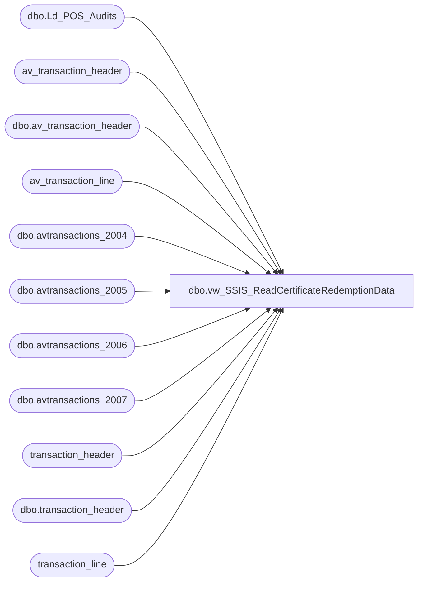

# dbo.vw_SSIS_ReadCertificateRedemptionData

**Database:** auditworks  
**Server:** bedrockdb01  

## Architecture Diagram



## Table Dependencies

| Referenced Table |
|---|
| dbo.Ld_POS_Audits |
| av_transaction_header |
| dbo.av_transaction_header |
| av_transaction_line |
| dbo.avtransactions_2004 |
| dbo.avtransactions_2005 |
| dbo.avtransactions_2006 |
| dbo.avtransactions_2007 |
| transaction_header |
| dbo.transaction_header |
| transaction_line |

## View Code

```sql
CREATE view [dbo].[vw_SSIS_ReadCertificateRedemptionData]

AS
	SELECT transaction_id, store_no, transaction_no, reference_no, CAST(SUBSTRING(reference_no, PATINDEX('%[1-9]%', reference_no), 9) AS int) AS reference_no_for_crm, transaction_date
		,gross_line_amount
	FROM
	(
		SELECT tl.av_transaction_id AS transaction_id, th.store_no, th.transaction_no, tl.reference_no, th.transaction_date, tl.gross_line_amount - ISNULL(tl_adj.gross_line_amount, 0) AS gross_line_amount
		FROM (SELECT DISTINCT transaction_id FROM dbo.Ld_POS_Audits  WITH (NOLOCK)) a
		INNER JOIN dbo.av_transaction_header th  WITH (NOLOCK) ON th.av_transaction_id = a.transaction_id
			AND th.transaction_void_flag = 0
		INNER JOIN av_transaction_line tl  WITH (NOLOCK) ON tl.av_transaction_id = th.av_transaction_id
			AND line_void_flag = 0
			-- line action of 25 is a redemption
			AND line_action = 25
		LEFT JOIN av_transaction_line tl_adj  WITH (NOLOCK) ON tl_adj.av_transaction_id = tl.av_transaction_id
			AND tl_adj.line_action = 13
			AND tl_adj.line_object = 1130
			AND tl.reference_no = (SELECT MAX(tl2.reference_no) FROM av_transaction_line tl2 WHERE tl2.av_transaction_id = th.av_transaction_id AND tl2.line_void_flag = 0 AND tl2.line_action = 25 AND tl2.reference_type = 31)
		WHERE tl.reference_type = 31
			AND th.store_no <> 990

		UNION

		SELECT tl.av_transaction_id AS transaction_id, th.store_no, th.transaction_no, tl.reference_no, th.transaction_date, tl.gross_line_amount - ISNULL(tl_adj.gross_line_amount, 0) AS gross_line_amount
		FROM av_transaction_header th  WITH (NOLOCK)
		INNER JOIN av_transaction_line tl  WITH (NOLOCK) ON tl.av_transaction_id = th.av_transaction_id
			AND line_void_flag = 0
			-- line action of 25 is a redemption
			AND line_action = 25
		LEFT JOIN av_transaction_line tl_adj  WITH (NOLOCK) ON tl_adj.av_transaction_id = tl.av_transaction_id
			AND tl_adj.line_action = 13
			AND tl_adj.line_object = 1130
			AND tl.reference_no = (SELECT MAX(tl2.reference_no) FROM av_transaction_line tl2 WHERE tl2.av_transaction_id = th.av_transaction_id AND tl2.line_void_flag = 0 AND tl2.line_action = 25 AND tl2.reference_type = 31)
		WHERE tl.reference_type = 31
			AND th.store_no <> 990
			--AND tl.av_transaction_id > @prev_max_transaction_id
			AND th.transaction_void_flag = 0
	) t

	UNION ALL

	SELECT transaction_id, store_no, transaction_no, reference_no, CAST(SUBSTRING(reference_no, PATINDEX('%[1-9]%', reference_no), 9) AS int) AS reference_no_for_crm, transaction_date
		,gross_line_amount
	FROM
	(
		SELECT tl.transaction_id, th.store_no, th.transaction_no, tl.reference_no, th.transaction_date, tl.gross_line_amount - ISNULL(tl_adj.gross_line_amount, 0) AS gross_line_amount
		FROM (SELECT DISTINCT transaction_id FROM dbo.Ld_POS_Audits  WITH (NOLOCK)) a
		INNER JOIN dbo.transaction_header th  WITH (NOLOCK) ON th.transaction_id = a.transaction_id
			AND th.transaction_void_flag = 0
		INNER JOIN transaction_line tl  WITH (NOLOCK) ON tl.transaction_id = th.transaction_id
			AND line_void_flag = 0
			-- line action of 25 is a redemption
			AND line_action = 25
		LEFT JOIN transaction_line tl_adj  WITH (NOLOCK) ON tl_adj.transaction_id = tl.transaction_id
			AND tl_adj.line_action = 13
			AND tl_adj.line_object = 1130
			AND tl.reference_no = (SELECT MAX(tl2.reference_no) FROM transaction_line tl2 WHERE tl2.transaction_id = th.transaction_id AND tl2.line_void_flag = 0 AND tl2.line_action = 25 AND tl2.reference_type = 31)
		WHERE tl.reference_type = 31
			AND th.store_no <> 990

		UNION

		SELECT tl.transaction_id, th.store_no, th.transaction_no, tl.reference_no, th.transaction_date, tl.gross_line_amount - ISNULL(tl_adj.gross_line_amount, 0) AS gross_line_amount
		FROM transaction_header th
		INNER JOIN transaction_line tl  WITH (NOLOCK) ON tl.transaction_id = th.transaction_id
			AND line_void_flag = 0
			-- line action of 25 is a redemption
			AND line_action = 25
		LEFT JOIN transaction_line tl_adj  WITH (NOLOCK) ON tl_adj.transaction_id = tl.transaction_id
			AND tl_adj.line_action = 13
			AND tl_adj.line_object = 1130
			AND tl.reference_no = (SELECT MAX(tl2.reference_no) FROM transaction_line tl2 WHERE tl2.transaction_id = th.transaction_id AND tl2.line_void_flag = 0 AND tl2.line_action = 25 AND tl2.reference_type = 31)
		WHERE tl.reference_type = 31
			AND th.store_no <> 990
			--AND tl.transaction_id > @prev_max_transaction_id
			AND th.transaction_void_flag = 0
	) t


UNION 

select * FROM auditworks.dbo.avtransactions_2006 --209471 (OURSBLANC)

UNION

select * from auditworks.dbo.avtransactions_2004  --16904 (OURSBLANC)

UNION 

select * from auditworks.dbo.avtransactions_2005  --57697 (OURSBLANC)

UNION 

select * from auditworks.dbo.avtransactions_2007 --138820
```

