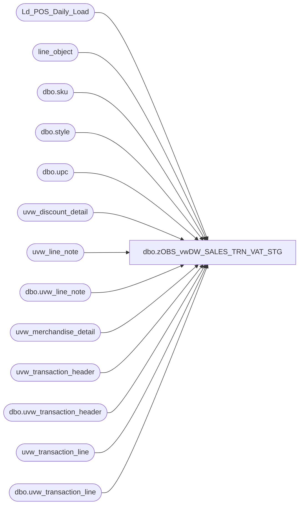

# dbo.zOBS_vwDW_SALES_TRN_VAT_STG

**Database:** auditworks  
**Server:** bedrockdb01  

## Architecture Diagram



## Table Dependencies

| Referenced Table |
|---|
| Ld_POS_Daily_Load |
| line_object |
| dbo.sku |
| dbo.style |
| dbo.upc |
| uvw_discount_detail |
| uvw_line_note |
| dbo.uvw_line_note |
| uvw_merchandise_detail |
| uvw_transaction_header |
| dbo.uvw_transaction_header |
| uvw_transaction_line |
| dbo.uvw_transaction_line |

## View Code

```sql
-- =====================================================================================================
-- Name: vwDW_SALES_TRN_VAT_STG
--
-- Description:	Extract information from Audit works for the morning run based upon the
--			transaction numbers loaded into 
--
--
-- Dependencies: None
--
-- Revision History
--		Name:			Date:			Comments:
--		Gary Murrish	5/29/2013		Added ReferenceNo logic for Coupons using Line Note 9006
--		Shawn Burge		9/14/2012		Added BearID
--		Gary Murrish	12/8/2011		Blocked out store 13, register 3 until after 1/31/2012
-- =====================================================================================================

CREATE VIEW [dbo].[vwDW_SALES_TRN_VAT_STG]
AS
WITH vw1621
AS (
SELECT th.[transaction_id]
	 , (
		SELECT max(line_sequence)
		FROM
			[dbo].[uvw_transaction_line]
		WHERE
			[transaction_id] = th.[transaction_id]
			AND [line_sequence] < tl.[line_sequence]) [line_sequence]
	 , ln.[line_note]
FROM
	[dbo].[uvw_transaction_header] th
	INNER JOIN [dbo].[uvw_transaction_line] tl
		ON tl.[transaction_id] = th.[transaction_id]
		AND [line_object] = 1621
	INNER JOIN [dbo].[uvw_line_note] ln
		ON tl.[transaction_id] = ln.[transaction_id]
		AND tl.[line_id] = ln.[line_id]
		AND ln.[note_type] = 35)
SELECT th.transaction_date
	 , th.store_no
	 , th.register_no
	 , th.transaction_id
	 , th.transaction_no
	 , tl.line_id
	 , tl.line_sequence
	 , th.cashier_no
	 , tl.gross_line_amount
	 , tl.pos_discount_amount
	 , dd.pos_discount_type
	 , th.entry_date_time
	 , lo.line_object
	 , lo.line_object_type
	 , lo.line_object_description
	 , CASE
		   WHEN len(tl.reference_no) > 6 AND tl.line_object = 100 AND tl.reference_no NOT LIKE '0000%' THEN
			   (SELECT st.style_code
				FROM
					OURSMERCHDB01.me_01.dbo.upc u WITH (NOLOCK)
					JOIN OURSMERCHDB01.me_01.dbo.sku sk WITH (NOLOCK)
						ON sk.sku_id = u.sku_id
					JOIN OURSMERCHDB01.me_01.dbo.style st WITH (NOLOCK)
						ON st.style_id = sk.style_id
				WHERE
					u.upc_number = tl.reference_no
			   )
		   ELSE
			   COALESCE(n9006.line_note, ISNULL(tl.reference_no, ''))
	   END reference_no
	 , tl.line_action
	 , md.units
	 , th.transaction_category
	 , CASE
		   WHEN isnull(cast(vat.line_note AS DECIMAL(9, 2)), 0) = 0 THEN
			   isnull((SELECT TOP 1 line_note
					   FROM
						   vw1621
					   WHERE
						   transaction_id = tl.transaction_id
						   AND line_sequence = tl.line_sequence
					   ORDER BY
						   line_sequence), 0)
		   ELSE
			   isnull(cast(vat.line_note AS DECIMAL(9, 2)), 0)
	   END Vat_Tax_Amt
	 , cast(vwsn.line_note AS VARCHAR(100)) AS VirtualWorld_SerialNumber, brln.line_note AS bear_id
--cast(cast(th.transaction_no as varchar) + cast(th.store_no as varchar) + cast(th.register_no as varchar) as varchar(50)) transaction_store_register_concat,
--case when (ROW_NUMBER() OVER (PARTITION BY th.transaction_date, th.[store_no], th.[register_no], th.[transaction_id]
--    ORDER BY th.transaction_date, th.[store_no], th.[register_no], th.[transaction_id]) = 1) then 1 else 0 end [transaction_begin]
FROM
	Ld_POS_Daily_Load dl WITH (NOLOCK)
	JOIN uvw_transaction_header th WITH (NOLOCK)
		ON th.transaction_id = dl.transaction_id
	--uvw_transaction_header th with (nolock)
	JOIN uvw_transaction_line tl WITH (NOLOCK)
		ON tl.transaction_id = th.transaction_id

	JOIN line_object lo WITH (NOLOCK)
		ON lo.line_object_type = tl.line_object_type
		AND lo.line_object = tl.line_object

	LEFT JOIN
		(SELECT d.transaction_id
			  , d.line_id
			  , min(d.pos_discount_type) AS pos_discount_type
		 FROM
			 Ld_POS_Daily_Load dl WITH (NOLOCK)
			 JOIN uvw_discount_detail d WITH (NOLOCK)
				 ON d.transaction_id = dl.transaction_id
		 GROUP BY
			 d.transaction_id
		   , d.line_id) dd

		ON dd.transaction_id = tl.transaction_id
		AND dd.line_id = tl.line_id

	LEFT JOIN uvw_merchandise_detail md WITH (NOLOCK)
		ON md.transaction_id = tl.transaction_id
		AND md.line_id = tl.line_id

	LEFT JOIN uvw_line_note vat WITH (NOLOCK)
		ON vat.transaction_id = tl.transaction_id
		AND vat.line_id = tl.line_id
		AND vat.note_type = 35


	LEFT JOIN uvw_line_note vwsn WITH (NOLOCK)
		ON vwsn.transaction_id = tl.transaction_id
		AND vwsn.line_id = tl.line_id
		AND vwsn.note_type = 36

	LEFT JOIN uvw_line_note n9006 WITH (NOLOCK)
		ON n9006.transaction_id = tl.transaction_id
		AND n9006.line_id = tl.line_id
		AND n9006.note_type = 9006

LEFT OUTER JOIN [dbo].[uvw_line_note] brln WITH (NOLOCK)
	ON tl.[line_id] = brln.[line_id] AND tl.[transaction_id] = brln.transaction_id AND brln.[note_type] = 6
	
WHERE
	1 = 1
	AND th.transaction_series IN ('P', '', 'D', 'F', 'W', 'A')
	AND th.transaction_void_flag = 0
	AND tl.line_void_flag = 0
	--and th.transaction_id = 196448460
	AND ((th.transaction_category IN (1, 2)
			AND tl.line_object_type <> 12)
		OR (th.transaction_category IN (10)
			AND tl.line_object_type = 7
			AND tl.line_object BETWEEN 700 AND 799)
	)
	AND NOT (th.store_no = 13		
			 AND th.register_no = 3
			 and th.transaction_date <= '1/31/2012'
			)	-- Block for Web transactions per Jack McCormick 12/8/2011
	

UNION

-- pull in 1199 discount line from the groupon adjustment - do not bring in other parts of that transaction
SELECT th.transaction_date
	 , th.store_no
	 , th.register_no
	 , th.transaction_id
	 , th.transaction_no
	 , tl.line_id
	 , tl.line_sequence
	 , th.cashier_no
	 , tl.gross_line_amount
	 , tl.pos_discount_amount
	 , dd.pos_discount_type
	 , th.entry_date_time
	 , lo.line_object
	 , lo.line_object_type
	 , lo.line_object_description
	 , CASE
		   WHEN len(tl.reference_no) > 6 AND tl.line_object = 100 AND tl.reference_no NOT LIKE '0000%' THEN
			   (SELECT st.style_code
				FROM
					OURSMERCHDB01.me_01.dbo.upc u WITH (NOLOCK)
					JOIN OURSMERCHDB01.me_01.dbo.sku sk WITH (NOLOCK)
						ON sk.sku_id = u.sku_id
					JOIN OURSMERCHDB01.me_01.dbo.style st WITH (NOLOCK)
						ON st.style_id = sk.style_id
				WHERE
					u.upc_number = tl.reference_no
			   )
		   ELSE
			    COALESCE(n9006.line_note, ISNULL(tl.reference_no, ''))
	   END reference_no
	 , tl.line_action
	 , md.units
	 , th.transaction_category
	 , CASE
		   WHEN isnull(cast(vat.line_note AS DECIMAL(9, 2)), 0) = 0 THEN
			   isnull((SELECT TOP 1 line_note
					   FROM
						   vw1621
					   WHERE
						   transaction_id = tl.transaction_id
						   AND line_sequence = tl.line_sequence
					   ORDER BY
						   line_sequence), 0)
		   ELSE
			   isnull(cast(vat.line_note AS DECIMAL(9, 2)), 0)
	   END Vat_Tax_Amt
	 , cast(vwsn.line_note AS VARCHAR(100)) AS VirtualWorld_SerialNumber, brln.line_note AS bear_id
--cast(cast(th.transaction_no as varchar) + cast(th.store_no as varchar) + cast(th.register_no as varchar) as varchar(50)) transaction_store_register_concat,
--case when (ROW_NUMBER() OVER (PARTITION BY th.transaction_date, th.[store_no], th.[register_no], th.[transaction_id]
--    ORDER BY th.transaction_date, th.[store_no], th.[register_no], th.[transaction_id]) = 1) then 1 else 0 end [transaction_begin]
FROM
	Ld_POS_Daily_Load dl WITH (NOLOCK)
	JOIN uvw_transaction_header th WITH (NOLOCK)
		ON th.transaction_id = dl.transaction_id

	JOIN uvw_transaction_line tl WITH (NOLOCK)
		ON tl.transaction_id = th.transaction_id

	JOIN line_object lo WITH (NOLOCK)
		ON lo.line_object_type = tl.line_object_type
		AND lo.line_object = tl.line_object

	LEFT JOIN
		(SELECT d.transaction_id
			  , d.line_id
			  , min(d.pos_discount_type) AS pos_discount_type
		 FROM
			 Ld_POS_Daily_Load dl WITH (NOLOCK)
			 JOIN uvw_discount_detail d WITH (NOLOCK)
				 ON d.transaction_id = dl.transaction_id
		 GROUP BY
			 d.transaction_id
		   , d.line_id) dd

		ON dd.transaction_id = tl.transaction_id
		AND dd.line_id = tl.line_id

	LEFT JOIN uvw_merchandise_detail md WITH (NOLOCK)
		ON md.transaction_id = tl.transaction_id
		AND md.line_id = tl.line_id

	LEFT JOIN uvw_line_note vat WITH (NOLOCK)
		ON vat.transaction_id = tl.transaction_id
		AND vat.line_id = tl.line_id
		AND vat.note_type = 35

	LEFT JOIN uvw_line_note vwsn WITH (NOLOCK)
		ON vwsn.transaction_id = tl.transaction_id
		AND vwsn.line_id = tl.line_id
		AND vwsn.note_type = 36

	LEFT JOIN uvw_line_note n9006 WITH (NOLOCK)
		ON n9006.transaction_id = tl.transaction_id
		AND n9006.line_id = tl.line_id
		AND n9006.note_type = 9006

LEFT OUTER JOIN [dbo].[uvw_line_note] brln WITH (NOLOCK)
	ON tl.[line_id] = brln.[line_id] AND tl.[transaction_id] = brln.transaction_id AND brln.[note_type] = 6
WHERE
	th.transaction_series IN ('N')
	AND tl.line_object = 1199
	AND th.transaction_void_flag = 0
	AND tl.line_void_flag = 0
	AND NOT (th.store_no = 13		
			 AND th.register_no = 3
			 and th.transaction_date <= '1/31/2012'
			)	-- Block for Web transactions per Jack McCormick 12/8/2011

--and th.transaction_id = 196448460

UNION

-- pull in fake merchandise so that we can tie the 1199 discount line from the groupon adjustment to it
SELECT th.transaction_date
	 , th.store_no
	 , th.register_no
	 , th.transaction_id
	 , th.transaction_no
	 , 1 line_id
	 , 111 line_sequence
	 , th.cashier_no
	 , 0 gross_line_amount
	 , tl.gross_line_amount pos_discount_amount
	 , --	tl.gross_line_amount*-1 pos_discount_amount, 

	   NULL pos_discount_type
	 , th.entry_date_time
	 , 100 line_object
	 , 1 line_object_type
	 , 'Merchandise' line_object_description
	 , '000000' reference_no
	 , 1 line_action
	 , 1 units
	 , th.transaction_category
	 , CASE
		   WHEN isnull(cast(vat.line_note AS DECIMAL(9, 2)), 0) = 0 THEN
			   isnull((SELECT TOP 1 line_note
					   FROM
						   vw1621
					   WHERE
						   transaction_id = tl.transaction_id
						   AND line_sequence = tl.line_sequence
					   ORDER BY
						   line_sequence), 0)
		   ELSE
			   isnull(cast(vat.line_note AS DECIMAL(9, 2)), 0)
	   END Vat_Tax_Amt
	 , cast(vwsn.line_note AS VARCHAR(100)) AS VirtualWorld_SerialNumber, brln.line_note AS bear_id
--cast(cast(th.transaction_no as varchar) + cast(th.store_no as varchar) + cast(th.register_no as varchar) as varchar(50)) transaction_store_register_concat,
--case when (ROW_NUMBER() OVER (PARTITION BY th.transaction_date, th.[store_no], th.[register_no], th.[transaction_id]
--    ORDER BY th.transaction_date, th.[store_no], th.[register_no], th.[transaction_id]) = 1) then 1 else 0 end [transaction_begin]
FROM
	Ld_POS_Daily_Load dl WITH (NOLOCK)
	JOIN uvw_transaction_header th WITH (NOLOCK)
		ON th.transaction_id = dl.transaction_id

	JOIN uvw_transaction_line tl WITH (NOLOCK)
		ON tl.transaction_id = th.transaction_id

	LEFT JOIN uvw_line_note vat WITH (NOLOCK)
		ON vat.transaction_id = tl.transaction_id
		AND vat.line_id = tl.line_id
		AND vat.note_type = 35

	LEFT JOIN uvw_line_note vwsn WITH (NOLOCK)
		ON vwsn.transaction_id = tl.transaction_id
		AND vwsn.line_id = tl.line_id
		AND vwsn.note_type = 36
LEFT OUTER JOIN [dbo].[uvw_line_note] brln WITH (NOLOCK)
	ON tl.[line_id] = brln.[line_id] AND tl.[transaction_id] = brln.transaction_id AND brln.[note_type] = 6
WHERE
	th.transaction_series IN ('N')
	AND tl.line_object = 1199
	AND th.transaction_void_flag = 0
	AND tl.line_void_flag = 0
	AND NOT (th.store_no = 13		
			 AND th.register_no = 3
			 and th.transaction_date <= '1/31/2012'
			)	-- Block for Web transactions per Jack McCormick 12/8/2011

--and th.transaction_id = 196448460
```

