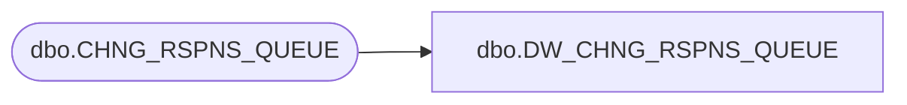

# dbo.DW_CHNG_RSPNS_QUEUE

**Database:** auditworks_external  
**Server:** bedrockdb01  

## Architecture Diagram



## Table Dependencies

| Referenced Table |
|---|
| dbo.CHNG_RSPNS_QUEUE |

## View Code

```sql
create view dbo.DW_CHNG_RSPNS_QUEUE AS
SELECT ENTY_TYPE,
       ENTY_ID,
       ENTY_NUM,
       ENTY_CODE,
       STS,
       LCKD,
       CHNG_DATE_TIME FROM dbo.CHNG_RSPNS_QUEUE
```

