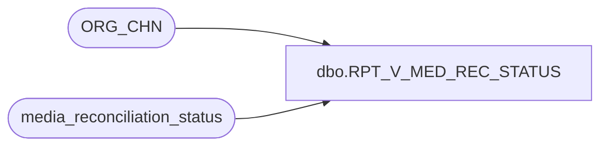

# dbo.RPT_V_MED_REC_STATUS

**Database:** auditworks_external  
**Server:** bedrockdb01  

## Architecture Diagram



## Table Dependencies

| Referenced Table |
|---|
| ORG_CHN |
| media_reconciliation_status |

## View Code

```sql
create view dbo.RPT_V_MED_REC_STATUS 
AS

SELECT	 DISTINCT
m.store_no, s.ORG_CHN_NAME, MAX(m.last_activity_date_time) last_activity_date_time, m.rec_group_line_object, 
SUM(m.current_balance_amount) current_balance, 
SUM(m.current_balance_exchange_amt) current_balance_exchange, s.DFLT_CRNCY_CODE 
FROM
media_reconciliation_status m,
ORG_CHN s
WHERE
m.store_no = s.ORG_CHN_NUM
AND m.rec_group_line_object <> -2 
GROUP BY
m.store_no, s.ORG_CHN_NAME,
m.rec_group_line_object,
s.DFLT_CRNCY_CODE
HAVING sum(m.current_balance_amount) <> 0
```

