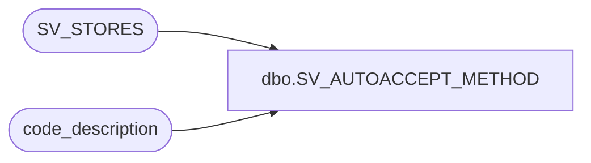

# dbo.SV_AUTOACCEPT_METHOD

**Database:** auditworks_external  
**Server:** bedrockdb01  

## Architecture Diagram



## Table Dependencies

| Referenced Table |
|---|
| SV_STORES |
| code_description |

## View Code

```sql
create view dbo.SV_AUTOACCEPT_METHOD
AS                             
SELECT o.ORG_CHN_NUM, o.AUTO_ACPT, c.code_display_descr as AUTO_ACPT_METHOD
 FROM SV_STORES o 
 LEFT JOIN code_description c ON (c.code_type = 70 AND o.AUTO_ACPT = c.code)
```

