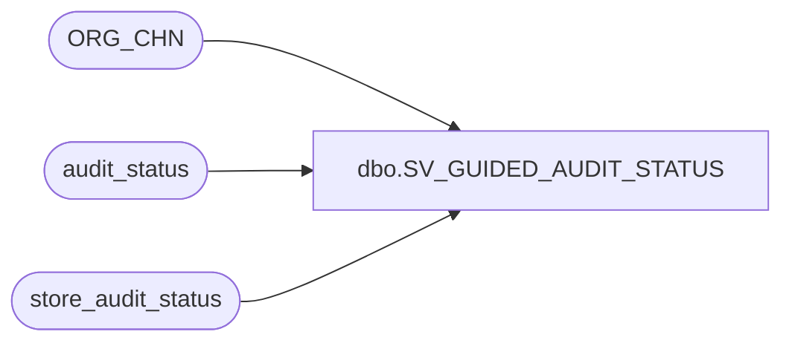

# dbo.SV_GUIDED_AUDIT_STATUS

**Database:** auditworks_external  
**Server:** bedrockdb01  

## Architecture Diagram



## Table Dependencies

| Referenced Table |
|---|
| ORG_CHN |
| audit_status |
| store_audit_status |

## View Code

```sql
create view dbo.SV_GUIDED_AUDIT_STATUS 
AS 
select a.store_no, a.register_no, a.date_reject_id, a.sales_date, a.audit_status, a.status_date, 
a.sos_check_complete, a.short_by_tender_over_limit, a.opening_drawer_discrepancy, a.media_rec_verified, a.exceptions_verified,
a.duplicate_verified, a.translate_error_verified, a.missing_verified, transaction_rollover_flag, a.archived_flag, a.sa_reject_qty,
a.if_reject_qty, a.translate_error_qty, a.missing_qty, a.exception_qty, a.duplicate_qty, a.media_short, a.valid_qty, 
a.first_transaction_no, a.last_transaction_no, a.status_remark, a.edited_date, a.status_set_by_user_id,  
((a.audit_status - a.audit_status * sign(a.date_reject_id) * 
(1 - sign(1 + sign(a.audit_status - 200)))) *
(1-sign(s.update_in_progress)) 
+ 13 * sign (a.date_reject_id ) * (1 - sign(1 + sign(a.audit_status - 200))) * (1-sign(s.update_in_progress))+ sign(s.update_in_progress) * 50)
AS guided_audit_status,

((s.store_audit_status - s.store_audit_status * sign(s.date_reject_id) * 
(1 - sign(1 + sign(s.store_audit_status - 200)))) *
(1-sign(s.update_in_progress)) 
+ 13 * sign (s.date_reject_id ) * (1 - sign(1 + sign(s.store_audit_status - 200))) * (1-sign(s.update_in_progress))+ sign(s.update_in_progress) * 50) 
AS guided_store_audit_status,
s.status_remark AS store_status_remark,
s.update_in_progress,
s.store_audit_status,
s.status_set_by_user_id AS store_status_set_by_user_id,
a.trickle_in_progress_flag,
s.trickle_in_progress_flag AS store_trickle_flag,
COALESCE(a.unreconciled_media_present,0) AS unreconciled_flag,
a.completion_date_time AS audit_completion_date_time,
s.completion_date_time AS store_completion_date_time,
o.DFLT_CRNCY_CODE,
s.store_status_date
FROM store_audit_status s
     INNER JOIN audit_status a ON (s.store_no = a.store_no AND s.sales_date = a.sales_date AND s.date_reject_id = a.date_reject_id)
     LEFT JOIN ORG_CHN o ON (s.store_no = o.ORG_CHN_NUM)
```

