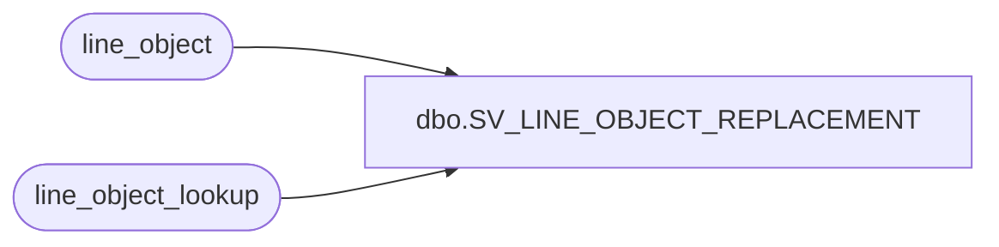

# dbo.SV_LINE_OBJECT_REPLACEMENT

**Database:** auditworks_external  
**Server:** bedrockdb01  

## Architecture Diagram



## Table Dependencies

| Referenced Table |
|---|
| line_object |
| line_object_lookup |

## View Code

```sql
create view dbo.SV_LINE_OBJECT_REPLACEMENT as
SELECT c.store_no,
       a.line_object_description as original_line_object,
       b.line_object_description as replacement_line_object
       
       from line_object_lookup c, line_object a, line_object b
       where a.line_object = c.lookup_line_object
       and b.line_object = c.line_object
```

