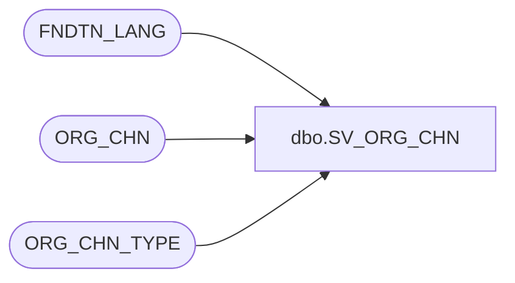

# dbo.SV_ORG_CHN

**Database:** auditworks_external  
**Server:** bedrockdb01  

## Architecture Diagram



## Table Dependencies

| Referenced Table |
|---|
| FNDTN_LANG |
| ORG_CHN |
| ORG_CHN_TYPE |

## View Code

```sql
create view [dbo].[SV_ORG_CHN] 
AS
SELECT o.ORG_CHN_NUM ,
o.PRTY_ID,
o.ORG_CHN_TYPE_CODE,
o.ORG_CHN_NAME,
o.ORG_CHN_SHRT_NAME,
o.ACTV,
o.GMT_OFST,
o.STLMNT_BLNG_NAME,
o.PLAN_START_DATE,
o.PLAN_END_DATE,
o.AUTO_ACPT,
o.USE_OFLN_INVNTRY_MNGMNT,
o.NTWRK_TYPE,
o.GL_CMPNY_NUM,
o.GL_LOC_NUM,
o.COMP_DATE,
o.RQR_ITEM_INFO,
o.SHIP_HOLD_DATE,
o.OPEN_TO_RCV_DATE,
o.CSTMR_PCKP,
o.OCPNCY_COST_FXD,
o.OCPNCY_COST_VRBL,
o.OCPNCY_COST_VRBL_THRSHLD,
o.CSTMR_SHPMNT,
o.SHRNKG_FCTR,
o.CLS_DATE,
o.OPEN_DATE,
o.RPLNSHBL,
o.TRNSFR_CPBLTY,
o.DFLT_ADRS_SEQ,
o.DFLT_CRNCY_CODE,
o.OPRT_HOUR_ID,
o.OPEN_HOUR_ID,
o.TAX_JRSDCTN_CODE,
o.MD_PRMTR_TBL_NUM,
o.VCHR_CNFG_TYPE,
o.PRMRY_BANK_ACNT_ID,
ISNULL(f.LANG_DESC, CONVERT(VARCHAR,o.PRMRY_LANG_ID)) AS PRMRY_LANG,
o.PRMRY_LANG_ID,
o.USE_AS_TMPLT,
o.TMPLT_DESC,
o.PRMRY_EML_ADRS_ID,
o.EXTRNL_RFRNC_NUM, 
t.SYS_CODE,
t.ORG_CHN_TYPE_SHRT_DESC  
FROM ORG_CHN o
     INNER JOIN ORG_CHN_TYPE t ON (o.ORG_CHN_TYPE_CODE = t.ORG_CHN_TYPE_CODE)
     LEFT JOIN FNDTN_LANG f ON (o.PRMRY_LANG_ID = f.LANG_ID)
```

