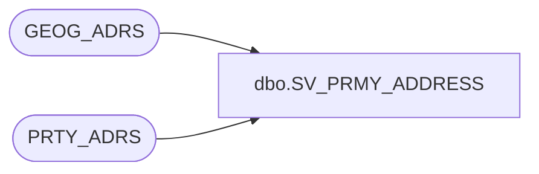

# dbo.SV_PRMY_ADDRESS

**Database:** auditworks_external  
**Server:** bedrockdb01  

## Architecture Diagram



## Table Dependencies

| Referenced Table |
|---|
| GEOG_ADRS |
| PRTY_ADRS |

## View Code

```sql
create view [dbo].[SV_PRMY_ADDRESS] 
AS 
SELECT a.PRTY_ID, a.ADRS_ID, g.CITY, g.TRTRY_CODE, g.CNTRY_CODE_ISO3
FROM PRTY_ADRS a, GEOG_ADRS g
WHERE a.ADRS_ID = g.ADRS_ID
AND a.ADRS_FNCTN_CODE = 'PRMY'
AND a.EFCTV_STRT_DATE < GETDATE()
AND (a.EFCTV_END_DATE >= getdate() OR a.EFCTV_END_DATE IS NULL)
```

