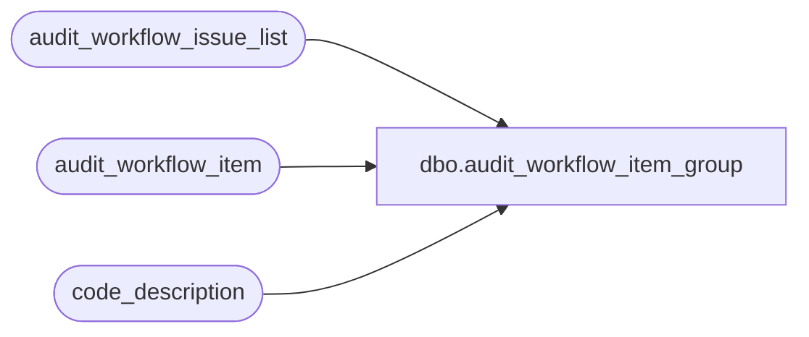

# dbo.audit_workflow_item_group

**Database:** auditworks_external  
**Server:** bedrockdb01  

## Architecture Diagram



## Table Dependencies

| Referenced Table |
|---|
| audit_workflow_issue_list |
| audit_workflow_item |
| code_description |

## View Code

```sql
CREATE VIEW dbo.audit_workflow_item_group 
AS
	SELECT w.audit_workflow_code,
               MIN(w.sequence_no) seq, 
	       w.workflow_issue_type, t.code_display_descr issue_type_desc, 
	       w.workflow_item_no,
	       CASE WHEN w.audit_workflow_item_group <> 0 THEN g.code_display_descr 
	            ELSE l.workflow_issue_descr END workflow_item_descr
	  FROM audit_workflow_item w
	       LEFT OUTER JOIN code_description t
	         ON t.code_type = 93
	        AND w.workflow_issue_type = t.code
	       LEFT OUTER JOIN code_description g
	         ON g.code_type = 91
	        AND w.audit_workflow_item_group = g.code
	       LEFT OUTER JOIN audit_workflow_issue_list l
	         ON w.workflow_issue_type = l.workflow_issue_type
	        AND w.workflow_issue_code = l.workflow_issue_code
	        AND w.workflow_issue_code_qualifier = l.workflow_issue_code_qualifier
	 GROUP BY 
	       w.audit_workflow_code,
	       w.workflow_issue_type, t.code_display_descr, 
	       w.workflow_item_no,
	       CASE WHEN w.audit_workflow_item_group <> 0 THEN g.code_display_descr 
	            ELSE l.workflow_issue_descr END
```

