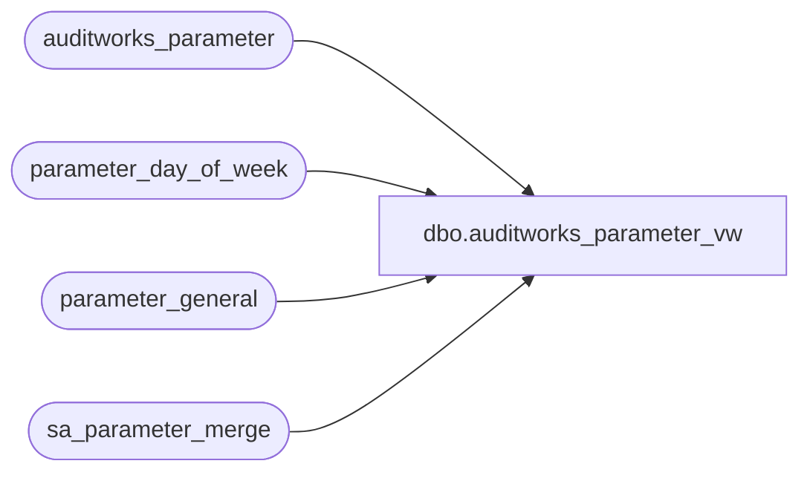

# dbo.auditworks_parameter_vw

**Database:** auditworks_external  
**Server:** bedrockdb01  

## Architecture Diagram



## Table Dependencies

| Referenced Table |
|---|
| auditworks_parameter |
| parameter_day_of_week |
| parameter_general |
| sa_parameter_merge |

## View Code

```sql
create view dbo.auditworks_parameter_vw     
AS
SELECT p.par_name,
       p.par_value,
       p.par_bin_value,
       p.par_name_display_descr,
       p.par_comment,
       
       p.par_type,
       p.par_value_from_range, 
       p.par_value_to_range,
       p.code_type,
       p.par_nullable_flag,
       p.warning_code,

       p.par_group_code, 
       p.par_node_id,
       'auditworks_parameter' par_source_table,
       p.resource_id,
       p.comment_resource_id,
       p.min_compatible_exe,
       p.drop_down_query
FROM auditworks_parameter p
WHERE p.active_flag > 0
union 
SELECT p.par_name,
CASE p.par_name  
	    WHEN 'ap_bank_code' THEN convert(varchar(1000), ap_bank_code)
	    WHEN 'ap_company_no' THEN convert(varchar(1000),  ap_company_no)
	    WHEN 'archive_days_retained' THEN convert(varchar(1000),  archive_days_retained)
	    WHEN 'audit_trail_days' THEN convert(varchar(1000),  audit_trail_days)
	    WHEN 'auto_upc_correction' THEN convert(varchar(1000),  auto_upc_correction)
	    WHEN 'concurrent_dayend_processes' THEN convert(varchar(1000),  concurrent_dayend_processes)
	    WHEN 'concurrent_edit_processes' THEN convert(varchar(1000),  concurrent_edit_processes)
	    WHEN 'current_day_autoaccept_time' THEN CASE WHEN current_day_autoaccept_time IS NULL THEN convert(varchar(1000), current_day_autoaccept_time) ELSE RIGHT('0000' + convert(varchar(1000),current_day_autoaccept_time), 4) END
	    WHEN 'dayend_batch_store_dates' THEN convert(varchar(1000),  dayend_batch_store_dates)
	    WHEN 'dayend_delayed_days' THEN convert(varchar(1000),  dayend_delayed_days)
	    WHEN 'dummy_upc_no' THEN convert(varchar(1000),  dummy_upc_no)
	    WHEN 'employee_purchase_days' THEN convert(varchar(1000),  employee_purchase_days)
	    WHEN 'extended_archive_days_retained' THEN convert(varchar(1000),  extended_archive_days_retained)
	    WHEN 'gl_account_segment_qty' THEN convert(varchar(1000),  gl_account_segment_qty)
	    WHEN 'glc_as_of_period_qty' THEN convert(varchar(1000),  glc_as_of_period_qty)
	    WHEN 'glc_export_used' THEN convert(varchar(1000),  glc_export_used)
	    WHEN 'glc_postable_used' THEN convert(varchar(1000),  glc_postable_used)
	    WHEN 'journal_entry_description' THEN journal_entry_description
	    WHEN 'last_date_closed' THEN convert(varchar(1000),  last_date_closed, 101)
	    WHEN 'media_category_statistics_days' THEN convert(varchar(1000),  media_category_statistics_days)
	    WHEN 'media_reconciliation_days' THEN convert(varchar(1000),  media_reconciliation_days)
	    WHEN 'object_action_lookup_flag' THEN convert(varchar(1000),  object_action_lookup_flag)
	    WHEN 'period_end_date' THEN convert(varchar(1000),  period_end_date, 101)
	    WHEN 'process_log_days' THEN convert(varchar(1000),  process_log_days)
	    WHEN 'register_activity_days' THEN convert(varchar(1000),  register_activity_days)
	    WHEN 'retain_class_code' THEN convert(varchar(1000),  retain_class_code)
	    WHEN 'sa_company_name' THEN sa_company_name
	    WHEN 'sa_company_no' THEN convert(varchar(1000),  sa_company_no)
	    WHEN 'set_employee_no_from_account' THEN convert(varchar(1000),  set_employee_no_from_account)
	    WHEN 'sku_lookup_method' THEN convert(varchar(1000),  sku_lookup_method)
	    WHEN 'sos_cash_days' THEN convert(varchar(1000),  sos_cash_days)
	    WHEN 'sos_credit_days' THEN convert(varchar(1000),  sos_credit_days)
	    WHEN 'store_performance_days' THEN convert(varchar(1000),  store_performance_days)
	    WHEN 'subledger_detail_periods' THEN convert(varchar(1000),  subledger_detail_periods)
	    WHEN 'subledger_periods' THEN convert(varchar(1000),  subledger_periods)
	    WHEN 'tax_days' THEN convert(varchar(1000),  tax_days)
	    WHEN 'tax_override_lookup' THEN convert(varchar(1000),  tax_override_lookup)
	    WHEN 'tax_periods' THEN convert(varchar(1000),  tax_periods)
	    WHEN 'trickle_polling_flag' THEN convert(varchar(1000),  trickle_polling_flag)
	   WHEN 'verify_attachments' THEN convert(varchar(1000),  verify_attachments)

       	    ELSE CONVERT(varchar, NULL) 
       END par_value,
       CONVERT(binary(16), null) par_bin_value,
       p.par_name_display_descr,
       p.par_comment,
       
       p.par_type,
       p.par_value_from_range, 
       p.par_value_to_range,
       p.code_type,
       p.par_nullable_flag,
       p.warning_code,

       p.par_group_code, 
       p.par_node_id,
       'parameter_general' par_source_table,
       p.resource_id,
       p.comment_resource_id,
       p.min_compatible_exe,
       p.drop_down_query
  FROM sa_parameter_merge p
       INNER JOIN parameter_general 
          ON 1=1
 WHERE p.par_source_table = 'parameter_general'
UNION
SELECT p.par_name,
       convert(varchar(1000), autoaccept_dayend_delay_hrs) par_value,
       convert(binary(16), NULL) par_bin_value,
       p.par_name_display_descr,
       p.par_comment,
       
       p.par_type,
       p.par_value_from_range, 
       p.par_value_to_range,
       p.code_type,
       p.par_nullable_flag,
       p.warning_code,

       p.par_group_code, 
       p.par_node_id,
       'parameter_day_of_week' par_source_table,
       p.resource_id,
       p.comment_resource_id,
       p.min_compatible_exe,
       p.drop_down_query
  FROM sa_parameter_merge p
       INNER JOIN parameter_day_of_week 
          ON p.par_name = convert(varchar, day_of_week)
 WHERE p.par_source_table = 'parameter_day_of_week'
```

