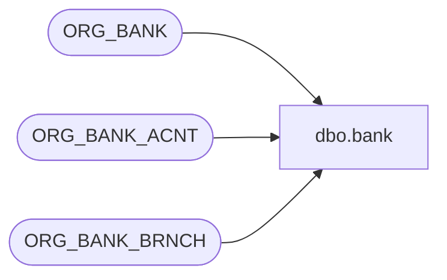

# dbo.bank

**Database:** auditworks_external  
**Server:** bedrockdb01  

## Architecture Diagram



## Table Dependencies

| Referenced Table |
|---|
| ORG_BANK |
| ORG_BANK_ACNT |
| ORG_BANK_BRNCH |

## View Code

```sql
create view dbo.bank 
AS
SELECT 
	BA.BANK_ACNT_ID as deposit_destination,
	B.INSTN_NUM as bank_id,
	BA.BANK_ACNT_NUM as bank_account_no,
	BA.BANK_ACNT_DESC as bank_account_name,
	BB.BANK_BRNCH_NAME as branch_name,
	B.BANK_NAME as bank_name
FROM 
	ORG_BANK B,
	ORG_BANK_ACNT BA,
	ORG_BANK_BRNCH BB
WHERE B.BANK_ID = BA.BANK_ID
  AND BA.SYS_CODE= 'STR'
  AND BA.BANK_BRNCH_ID = BB.BANK_BRNCH_ID
```

