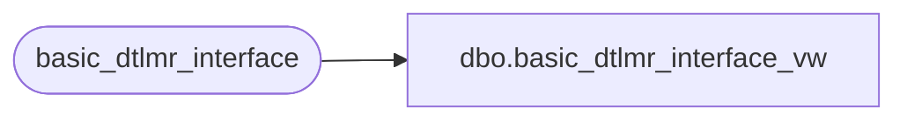

# dbo.basic_dtlmr_interface_vw

**Database:** auditworks_external  
**Server:** bedrockdb01  

## Architecture Diagram



## Table Dependencies

| Referenced Table |
|---|
| basic_dtlmr_interface |

## View Code

```sql
create view dbo.basic_dtlmr_interface_vw  AS
SELECT register_no, cashier_no, transaction_no, store_no, transaction_date,
       transaction_code, if_entry_no, entry_time, identifier, extended_amount,
       subcode, quantity, tender_total, subsystem
FROM basic_dtlmr_interface
```

