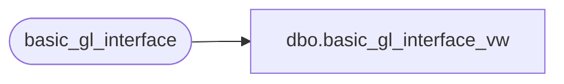

# dbo.basic_gl_interface_vw

**Database:** auditworks_external  
**Server:** bedrockdb01  

## Architecture Diagram



## Table Dependencies

| Referenced Table |
|---|
| basic_gl_interface |

## View Code

```sql
create view dbo.basic_gl_interface_vw  AS
SELECT
  record_type,
  journal_entry_description,
  detail_type_indicator,
  gl_account_no,
  amount,
  gl_period_no,
  period_ending_date,
  gl_company_no
FROM basic_gl_interface
```

