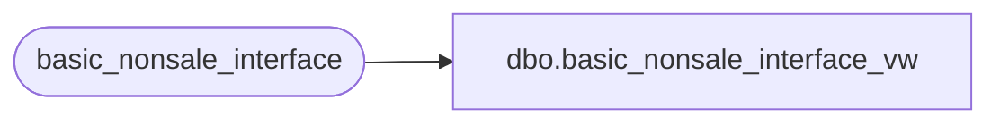

# dbo.basic_nonsale_interface_vw

**Database:** auditworks_external  
**Server:** bedrockdb01  

## Architecture Diagram



## Table Dependencies

| Referenced Table |
|---|
| basic_nonsale_interface |

## View Code

```sql
create view dbo.basic_nonsale_interface_vw  AS
SELECT register_no, cashier_no, transaction_no, store_no, transaction_date, entry_time,
       identifier, amount, subcode, quantity
FROM basic_nonsale_interface
```

