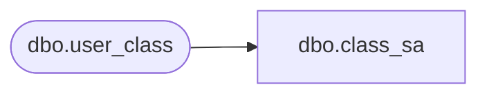

# dbo.class_sa

**Database:** auditworks_external  
**Server:** bedrockdb01  

## Architecture Diagram



## Table Dependencies

| Referenced Table |
|---|
| dbo.user_class |

## View Code

```sql
create view dbo.class_sa  
  AS 
  SELECT upc_lookup_division, 
  	class_code, 
	class_description, 
	class_short_description = substring(class_description, 1, 12), 
	department_code,
        tax_item_group_id,
        resource_id
    FROM auditworks_external.dbo.user_class
```

